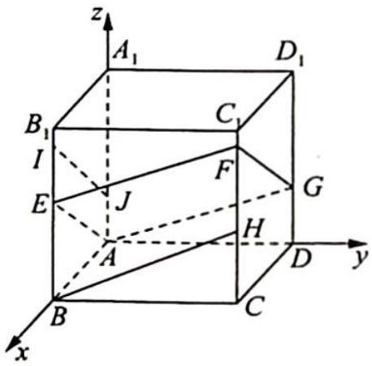

> [!faq]- 《高考数学培优40讲》参考答案
>
> > [!success]- **【答案】** 详见解析
>
> > [!note]- **【分析】**
> > 本题未单列分析。
>
> > [!note]- **【解析】**
> > - **①**：因为平面 AEFG 分别与平面 $ABB_{1}A_{1}$ ，平面 $ADD_{1}A_{1}$ ，平面 $CDD_{1}C_{1}$ ，平面 $BCC_{1}B_{1}$ 交于 AE，AG，FG，EF，易知平面 $ABB_{1}A_{1} \parallel$ 平面 $DCC_{1}D_{1}$ ，则 $AE \parallel FG$ ，同理 $EF \parallel AG$ ，所以四边形 AGFE 为平行四边形，故①正确.
> > - **②**：以 A 为原点, AB, AD, $AA_{1}$ 为 x, y, z 轴, 建立空间直角坐标系, 如图所示, G 在平面 $BCC_{1}B_{1}$ 上的投影点为 H, F, G 在平面 $ABB_{1}A_{1}$ 上的投影点为 I, J.
> > 设 BE = a, CF = b, DG = c, 其中 $0 \leqslant a, b, c \leqslant 1$ , 则 $E(1,0,a), F(1,1,b), G(0,1,c), A(0,0,0)$ , 所以 $\overrightarrow{AE} = (1,0,a), \overrightarrow{GF} = (1,0,b-c)$ , 由 $\overrightarrow{AE} = \overrightarrow{GF} \Rightarrow b = a + c$ , 则 $\left\{\begin{aligned}&0 \leqslant a \leqslant 1 \\&0 \leqslant a + c \leqslant 1\end{aligned}\right.$ 易得 $S_{1} = BE \cdot BC = BE = a, S_{2} = AB \cdot AJ = c$ , 所以 $S_{1} + S_{2} = a + 0 \leqslant c \leqslant 1$
> > 
> > $c=b\leqslant1$ , 故②错误.
> > - **③**：$S_{1} S_{2} = ac \leqslant \left(\frac{a + c}{2}\right)^{2} \leqslant \frac{1}{4}$ , 当且仅当 $a = c = \frac{1}{2}, b = 1$ 时取等号, 故③正确.
> > - **④**：$\overrightarrow{AF} = (1, 1, b), \overrightarrow{EG} = (-1, 1, c - a)$ , 令 $\overrightarrow{AF} \cdot \overrightarrow{EG} = -1 + 1 + b(c - a) = 0$ 得 $a = c$ , 即 $\left\{ \begin{array}{l} c = a \\ b = 2a \\ 0 \leqslant a \leqslant \frac{1}{2} \end{array} \right.$ , 则此时 $AF \perp EG$ . 平面四边形 $AEFG$ 为菱形, 而此时 $\overrightarrow{AF} = (1, 1, 2a), \overrightarrow{EG} = (-1, 1, 0), |\overrightarrow{AF}| = \sqrt{4a^{2} + 2}, |\overrightarrow{EG}| = \sqrt{2}$ , 所以 $S_{AEFG} = \frac{\sqrt{2}}{2} \sqrt{4a^{2} + 2}$ , 当 $a = \frac{1}{2}$ 时, $(S_{AEFG})_{\max} = \frac{\sqrt{2}}{2} \sqrt{4 \times \frac{1}{4} + 2} = \frac{\sqrt{6}}{2}$ , 故④正确.
> > 综上所述, 答案为①③④.
