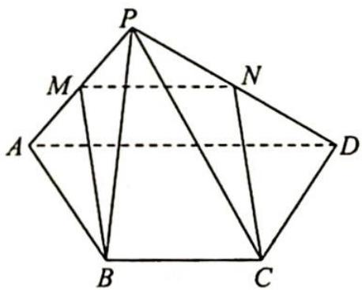
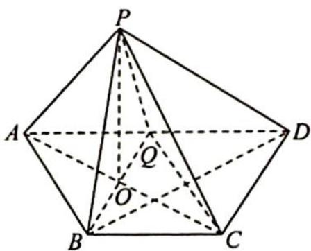

> [!faq]- 《高考数学培优40讲》参考答案
>
> > [!success]- **【答案】** ACD
>
> > [!note]- **【分析】**
> > 本题未单列分析。
>
> > [!note]- **【解析】**
> > A:如图1所示,取PA,PD中点分别为M,N,连接BM,MN,CN,则MN⊥BC,所以四边形BCNM为平行四边形,又PB=AB,所以BM⊥PA,NC⊥PA,又PA⊥PD,PD∩CN=N,则PA⊥平面PCD,故A选项正确.
> > B:若 PA=1,∠PBA=60°,此时 AB⊥平面 PBD 不成立,故 B 选项不一定正确.
> > C:如图2所示,取AD中点为Q,因为PA⊥PD,所以PQ=1,则△PAD中AD上的高h≤1.当PA=√2时,PQ⊥AD,S△PAD= $\frac{1}{2}$ ×2×1=1.故C选项正确.
> > 
> > 图1
> > 
> > 图 2
> > D: $S_{ABCD} = \frac{1}{2} \times (1 + 2) \times \frac{\sqrt{3}}{2} = \frac{3\sqrt{3}}{4}$ , 连接 $BQ, AC$ , 设 $BQ \cap AC = O$ , 连接 $PO$ , 易得 $\triangle PBQ$ 为等边三角形, 所以 $PO \perp BQ$ , 且 $PO = \frac{\sqrt{3}}{2}$ . 在菱形 $ABCQ$ 中, $BQ \perp AC, AC \cap PO = O$ , 所以 $BQ \perp$ 平面 $PAC$ , 进而平面 $PAC \perp$ 底面 $ABCD$ , 所以当平面 $PBQ \perp$ 平面 $ABCD$ , 即 $PO \perp AC$ 时, 点 $P$ 到底面 $ABCD$ 的距离最大为 $PO = \frac{\sqrt{3}}{2}$ , 故四棱锥 $P-ABCD$ 体积最大 ( $V_{P-ABCD}$ ) $_{max} = \frac{1}{3}Sh \leqslant \frac{1}{3} \times \frac{3\sqrt{3}}{4} \times \frac{\sqrt{3}}{2} = \frac{3}{8}$ , 故 D 选项正确.
> > 综上所述,一定正确的选项有 ACD.
