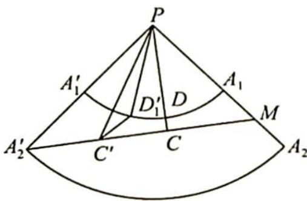

> [!faq]- 《高考数学培优40讲》参考答案
>
> > [!success]- **【答案】** 详见解析
>
> > [!note]- **【分析】**
> > 本题未单列分析。
>
> > [!note]- **【解析】**
> > 如图所示,将圆台的侧面沿母线 $A_{1}A_{2}$ 展开为扇形,延长 $A_{2}A_{1}, A_{2}^{\prime}A_{1}^{\prime}$ 交于 P,易知扇形的圆心角 $\theta=\frac{r_{2}-r_{1}}{A_{1}A_{2}}\cdot360^{\circ}=\frac{10-5}{20}\cdot360^{\circ}=90^{\circ}$ .
> > (1) 连接 $A_{2}^{\prime} M$ , 如果 $A_{2}^{\prime} M$ 与扇形 $A_{1}^{\prime} P A_{1}$ 不相交, 则 $A_{2}^{\prime} M$ 为绳子的最短长度.
> > 
> > 在 Rt△A'₂PM 中，PM = PA₁ + A₁M = 20 + 10 = 30，PA'₂ = 40，所以 A'₂M = 50，作 PC ⊥ A'₂M 于 C，由 PC · A'₂M = PM · PA'₂ 知 PC = $\frac{PM \cdot PA'_{2}}{A'_{2}M}$ = $\frac{30 \times 40}{50}$ = 24 > 20 = PA₁.
> > 故 $A_{2}^{\prime}M$ 与扇形 $A_{1}^{\prime}PA_{1}$ 不相交，所以绳子的最短长度为 50cm.
> > (2)设 $PC$ 交圆弧 $A_{1}^{\prime}A_{1}$ 于 $D$ , 证明 $CD$ 为绳子上点与上底面圆周上点的连线中的最短者, 假设 $CD$ 不是最短的, 那么另有一条更短的线段 $C^{\prime}D^{\prime}$ .
> > 连接 $PC'$ , 于是 $PD' + D'C' \geqslant PC' \geqslant PD + CD$ , 其中两个等号不能同时成立, 否则 $C'D'$ 与 $CD$ 重合, 而 $PD = PD'$ , 所以 $C'D' > CD$ , 这与 $C'D'$ 最小相矛盾. 故最短连线长 $CD = PC - PD = 24 - 20 = 4$ .
> > 综上所述,绳子上的点与上底圆周上点的连线的最小长度为4.
