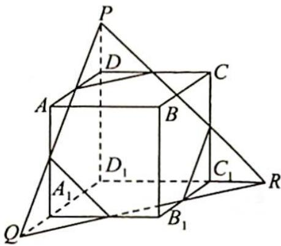
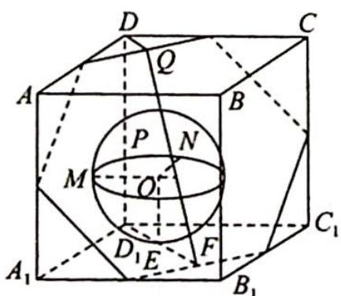
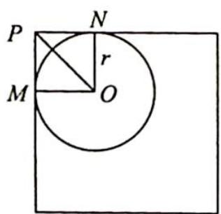
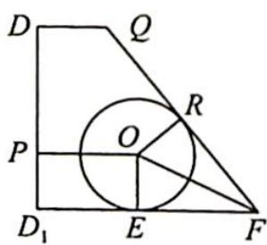
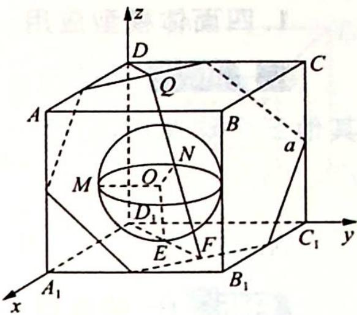

> [!faq]- 《高考数学培优40讲》例题解析
>
> > [!success]- **【答案】** 详见解析
>
> > [!note]- **【分析】**
> > 分析 ➤ 首先确定该几何体是正方体的一半,再研究其可容纳的最大球体.思路一:将几何体补形为一个正三棱锥,则该三棱锥内切球即为所求球体.思路二:求多面体能容纳的最大球的半径,则球面与各面相切,画出侧视图来分析.思路三:使用空间向量法,由于球心到平面的距离即为内切球半径,利用空间中点到平面的距离公式将距离用 r 表示出来,列方程求解.
>
> > [!note]- **【解析】**
> > 解析 ▶ 解法一(割补法): 如图 1 所示, 将几何体补形为正三棱锥 $D_{1}-PQR$ , 多面体即为此正三棱锥截去三个小正三棱锥, 则该三棱锥内切球即为所求球体.
> > 
> > 易知 $D_{1}P = 3, PQ = 3\sqrt{2}$ , 设球体半径为 $r$ , 则 $V_{D_1 - PQR} = \frac{1}{3} \times \left[\frac{\sqrt{3}}{4} \times (3\sqrt{2})^2 + \frac{3}{2} \times 3^2\right] \cdot r = \frac{1}{3} \times \frac{1}{2} \times 3^3, \left(\frac{9\sqrt{3}}{2} + \frac{27}{2}\right)r = \frac{27}{2}$ , 所以 $(3 + \sqrt{3})r = 3, r = \frac{3}{3 + \sqrt{3}} = \frac{3 - \sqrt{3}}{2}$ .
> > 图1
> > ## 评注
> > 该球不是原几何体的内切球,而是补形正三棱锥的内切球.
> > 解法二(截面法):如图2所示,设可容纳的最大球球心为O,则球面与底面 $A_{1}B_{1}C_{1}D_{1}$ 相切,和侧面 $ADD_{1}A_{1}$ 、侧面 $DCC_{1}D_{1}$ 相切,和截面正六边形相切.
> > 如图3所示,设球体半径为 $r$ , 则 $O$ 到棱 $DD_{1}$ 的距离 $OP = \sqrt{2} r$ . 如图4所示,在截面 $DD_{1}FQ$ 中, $DD_{1} = 2, DQ = \frac{\sqrt{2}}{2}, D_{1}F = \frac{3\sqrt{2}}{2}, OF$ 平分 $\angle D_{1}FQ$ .
> > 又 $\tan \angle D_{1}FQ = \frac{2}{\sqrt{2}} = \sqrt{2} = \frac{2\tan\angle OFE}{1 - \tan^{2}\angle OFE}$ 所以 $\tan \angle OFE = \frac{\sqrt{6} - \sqrt{2}}{2} = \frac{r}{EF}, EF = \frac{\sqrt{2}r}{\sqrt{3} - \sqrt{1}}$ 则 $D_{1}E + EF = \sqrt{2} r + \frac{\sqrt{2}r}{\sqrt{3} - 1} = \frac{3\sqrt{2}}{2} = D_{1}F$ ，故 $r = \frac{3}{2}\times \frac{1}{1 + \frac{1}{\sqrt{3} - 1}} = \frac{3}{2}\times \frac{\sqrt{3} - 1}{\sqrt{3}} = \frac{3 - \sqrt{3}}{2}$
> > 
> > 图2
> > 
> > 俯视图
> > 图3
> > 
> > 侧视图
> > 图 4
> > 解法三(向量法):如图5所示,建立空间直角坐标系 $D_{1}-xyz$ .
> > 
> > 易知 $D_{1}B \perp$ 正六边形截面 $\alpha, D_{1}(0,0,0), O(r,r,r)$ , 截面 $\alpha$ 的法向量为 $n = (2,2,2), F\left(\frac{3}{2}, \frac{3}{2}, 0\right), \overrightarrow{OF} = \left(\frac{3}{2} - r, \frac{3}{2} - r, -r\right)$ , 故球心 $O$ 到截面 $\alpha$ 的距离 $d = \frac{|\overrightarrow{OF} \cdot n|}{|n|} = \frac{|3 - 2r + 3 - 2r - 2r|}{2\sqrt{3}} = r$ , 解得 $r = \frac{3 - \sqrt{3}}{2}$ .
> > 
> > 图5
