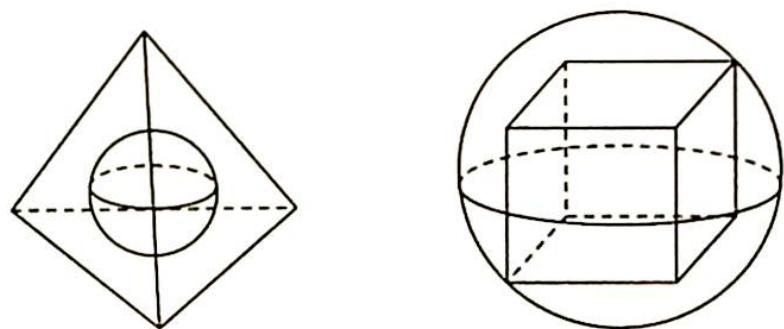

> [!faq]- 《高考数学培优40讲》例题解析
>
> > [!success]- **【答案】** 详见解析
>
> > [!note]- **【分析】**
> > 分析 ▶ 借助特殊几何体内切球、外接球处理即可.
>
> > [!note]- **【解析】**
> > 解析 如图所示,若正方体可以在正四面体内任意转动,则正方体的外接球最大可以是正四面体的内切球.
> > 
> > 因为正四面体的棱长为6,故内切球的半径 $r=\frac{\sqrt{6}}{12}\times6=\frac{\sqrt{6}}{2}$ ，设正方体的棱长为a，则其外接球的直径为 $\sqrt{3}a=\sqrt{6}$ ，解得 $a=\sqrt{2}$ 。故正方体的棱长的最大值为 $\sqrt{2}$ 。
> > 棱长为 a 的正四面体, 其外接球半径 $R=\frac{\sqrt{6}}{4}a$ , 内切球半径 $r=\frac{\sqrt{6}}{12}a$ .
