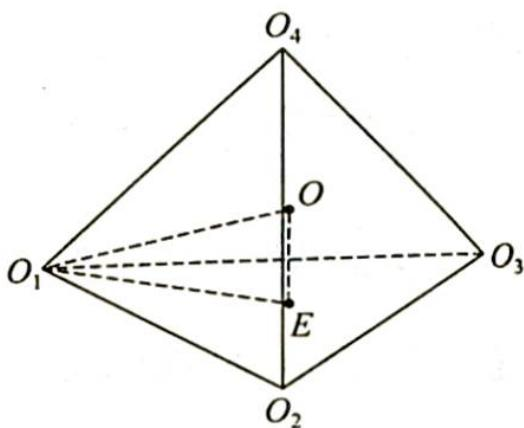

> [!faq]- 《高考数学培优40讲》例题解析
>
> > [!success]- **【答案】** A
>
> > [!note]- **【分析】**
> > 分析 ▶ 将这四个球的球心连接成一个正四面体,根据四个球外切可得正四面体的棱长为4,求出外接球的半径,由题意可得小球的球心与四面体外接球的球心重合.
>
> > [!note]- **【解析】**
> > 解析 由题意可知, 连接 4 个球的球心, 得到一个棱长为 4 的正四面体, 如图所示. 小球球心 O 为正四面体的中心, E 为 $O_{4}$ 在平面 $O_{1}O_{2}O_{3}$ 上的射影, 易求得 $O_{4}E = \sqrt{\frac{32}{3}}$ , 由 $OE^{2} + O_{1}E^{2} = O_{1}O^{2}$ , 即 $\left(\sqrt{\frac{32}{3}} - R\right)^{2} + \left(\frac{4}{\sqrt{3}}\right)^{2} = R^{2}$ , 解得 $R = \sqrt{6}$ , 所以正四面体中心到顶点的距
> > 
> > 离(即正四面体外接球的半径)为 $\sqrt{6}$ ，则 $2+r=\sqrt{6}$ ，从而所求小球的半径 $r=\sqrt{6}-2$ 。
> >
> > 故选 **A**.
