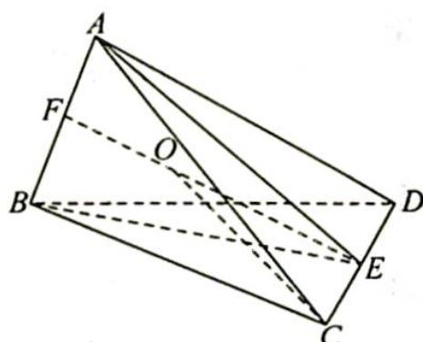

> [!faq]- 《高考数学培优40讲》例题解析
>
> > [!success]- **【答案】** 详见解析
>
> > [!note]- **【分析】**
> > 分析 如图所示, 以四个球的球心为顶点作四面体 $A-BCD$ , 则 $AB=6, CD=4, AC=AD=BC=BD=5$ , 设 $AB, CD$ 的中点分别为 $E, F$ , 小球的球心为 $O$ , 半径为 $r$ , 可证得 $O$ 必在线段 $EF$ 上, 利用勾股定理分别表示出 $OE, OF, EF$ , 然后由 $EF=OE+OF$ 列方程可求出 $r$ .
> >
> > 
>
> > [!note]- **【解析】**
> > 解析 ▶ 以四个球的球心为顶点作四面体 A-BCD，则 AB=6, CD=4, AC=AD=BC=BD=5，设 AB, CD 的中点分别为 E, F，设小球的球心为 O，半径为 r.
> > 因为 BC=BD, AC=AD, 所以 $BE \perp CD$ , $AE \perp CD$ , 则平面 ABE 是线段 CD 的中垂面.
> > 又因为 OC=OD=2+r，所以 O 在平面 ABE 上。同理，O 也在线段 AB 的中垂面 CDF 上，从而 O 必在线段 EF 上。
> > $OE = \sqrt{OC^2 - CE^2} = \sqrt{(2 + r)^2 - 2^2} = \sqrt{r^2 + 4r}, OF = \sqrt{OA^2 - AF^2} = \sqrt{(3 + r)^2 - 3^2} =$ $\sqrt{r^2 + 6r}, EF = \sqrt{BE^2 - BF^2} = \sqrt{BC^2 - CE^2 - BF^2} = \sqrt{5^2 - 2^2 - 3^2} = 2\sqrt{3}.$
> > 由 $EF = OE + OF$ 得 $\sqrt{r^2 + 4r} +\sqrt{r^2 + 6r} = 2\sqrt{3}$ ，解得 $r = \frac{6}{11}$
> > ## 2. 正方体模型应用
