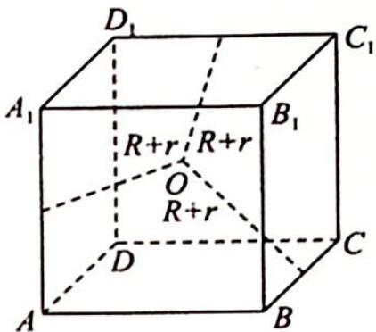

> [!faq]- 《高考数学培优40讲》例题解析
>
> > [!success]- **【答案】** 详见解析
>
> > [!note]- **【分析】**
> > 分析 ▶ 将圆柱的三条轴心线看作正方体的三条互为异面的棱.
>
> > [!note]- **【解析】**
> > 解析 如图所示,由正方体的对称性知球心 O 即为正方体的中心,三个圆柱的轴心线即为正方体的三条互为异面的棱 $A_{1}A, BC, C_{1}D_{1}$ , 因为三个圆柱体两两垂直且相切,所以正方体的棱长为 2R,则 $R^{2} + R^{2} = (R + r)^{2}$ , 所以 $r = (\sqrt{2} - 1)R$ .
> > 
> > ## 3. 圆锥模型应用
