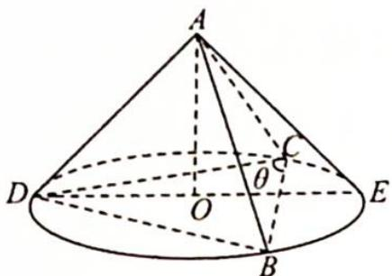
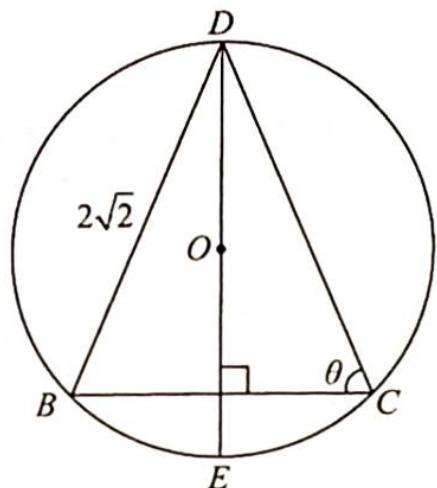
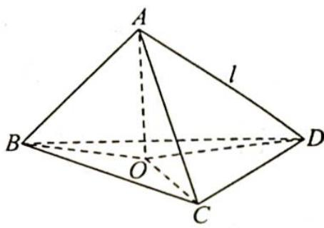

> [!faq]- 《高考数学培优40讲》例题解析
>
> > [!success]- **【答案】** D
>
> > [!note]- **【分析】**
> > 分析 ▶ 思路一: 因为 l, AB, AC 与平面 $\alpha$ 所成角始终相等, 所以 AD, AB, AC 可以看作某圆锥的三条母线.
> >
> > 思路二: 过 A 作 AO⊥平面 BCD, 垂足为 O, 连接 OB, OC, OD, 可得 Rt△OBA≌Rt△OCA ≌Rt△ODA, 进而得到点 O 为 △BDC 的外接圆圆心, AD=2, 另外要三棱锥 A-BCD 体积最大, 则必有 DA⊥平面 ABC, 通过计算可得 △BDC 的外接圆半径 r, 再通过计算 cos∠ODA= $\frac{OD}{AD}$ , 即可得答案.
>
> > [!note]- **【解析】**
> > 解析 ▶ 解法一:如图1所示,当 $DA \perp$ 平面 $ABC$ 时,三棱锥 $A-BCD$ 的体积最大.
> > 因为 $\triangle ABC$ 为边长为2的等边三角形,且 $l,AB,AC$ 与平面 $\alpha$ 所成角始终相等,所以 $AD$ , $AB,AC$ 可以看作某圆锥的三条母线,则 $AD=2$ .圆锥底面如图2所示, $DC=DB=2\sqrt{2},\cos\theta=\frac{1}{2\sqrt{2}}=\frac{\sqrt{2}}{4},\sin\theta=\frac{\sqrt{14}}{4}$ .
> > 故圆锥底面圆 O 的直径 $2r = DE = \frac{2\sqrt{2}}{\frac{\sqrt{14}}{4}} = \frac{8}{\sqrt{7}}$ ，则 $DO = r = \frac{4}{\sqrt{7}}$ ，直线 l 与平面 $\alpha$ 所成角大小为 $\angle ADO$ ，所以 $\cos \angle ADO = \frac{DO}{AD} = \frac{2}{\sqrt{7}} = \frac{2\sqrt{7}}{7}$ 。故选 D.
> > 
> > 图 1
> > 
> > 图 2
> > 解法二, 如图 3 所示, 过 $A$ 作 $AO \perp$ 平面 $BCD$ , 垂足为 $O$ , 连接 $OB, OC, OD$ , 因为直线 $l, AB, AC$ 与平面 $\alpha$ 所成的角始终相等, 即 $\angle OBA = \angle OCA = \angle ODA$ , 则 Rt $\triangle OBA \cong$ Rt $\triangle OCA \cong$ Rt $\triangle ODA$ , 也就是 $AD = AB = AC = BC = 2$ , $OB = OC = OD$ , 点 $O$ 为 $\triangle BDC$ 的外接圆圆心.
> > 
> > 图3
> > 要使三棱锥 A-BCD 体积最大, 则必有 $DA \perp$ 平面 ABC, 所以 $BD = CD = 2\sqrt{2}$ , 则 D 到 BC 的距离 $h = \sqrt{(2\sqrt{2})^{2} - 1} = \sqrt{7}$ . 又 $S_{\triangle DBC} = \frac{1}{2} \times 2 \times \sqrt{7} = \sqrt{7} = \frac{1}{2} \times (2\sqrt{2})^{2} \times \sin \angle BDC$ , 所以 $\sin \angle BDC = \frac{\sqrt{7}}{4}$ , 则 $\triangle BDC$ 的外接圆半径 $r = \frac{2}{2\sin \angle BDC} = \frac{1}{\frac{\sqrt{7}}{4}} = \frac{4}{\sqrt{7}}$ , 直线 l 与平面 $\alpha$ 所成角的余弦值 $\cos \angle ODA = \frac{OD}{AD} = \frac{\frac{4}{\sqrt{7}}}{2} = \frac{2\sqrt{7}}{7}$ .
> > 则直线 l 与平面 $\alpha$ 所成角的余弦值为 $\cos\angle ODA=\frac{2\sqrt{7}}{7}$ .
> >
> > 故选 **D**.
