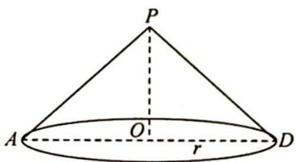
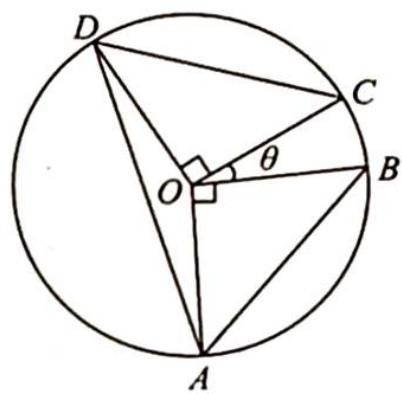

> [!faq]- 《高考数学培优40讲》例题解析
>
> > [!success]- **【答案】** 详见解析
>
> > [!note]- **【分析】**
> > 本题未单列分析。
>
> > [!note]- **【解析】**
> > 解析 ▶ △PAB 和 △PCD 均为边长为 $\sqrt{2}$ 的等边三角形, 所以 PA = PB = PC = PD = $\sqrt{2}$ , h = 1, 故考虑到圆锥, 如图 1 所示.
> > 设底面圆心为 O，则 PO=1, r=1.
> > 当四边形 $ABCD$ 为底面圆 $O$ 的内接正方形时, ① 正确; 由射影定义知 $O$ 点到 $P, A, B, C, D$ 的距离相等, 故② 正确; 当平面 $PAD \perp$ 平面 $ABCD$ 时, $AD$ 为直径, 半圆 $AD$ 上不可能存在两个不同的点, 且 $AB = CD = \sqrt{2}$ , 故③不正确; 在圆 $O$ 的内接四边形 $ABCD$ 中, 如图 2 所示, 因为 $AB = CD = \sqrt{2}, r = 1$ , 所以 $\angle DOC = \angle AOB = \frac{\pi}{2}$ . 设 $\angle BOC = \theta$ , 则 $\angle AOD = \pi - \theta, \theta \in \left(0, \frac{\pi}{2}\right]$ . $S_{ABCD} = \frac{1}{2} \times 1^2 \times \sin \frac{\pi}{2} \times 2 + \frac{1}{2} \times 1^2 \times \sin \theta + \frac{1}{2} \times 1^2 \times \sin (\pi - \theta) = 1 + \sin \theta \in (1, 2]$ , 则 $V_{P-ABCD} = \frac{1}{3} Sh = \frac{1}{3} S \in \left(\frac{1}{3}, \frac{2}{3}\right]$ , 故④正确.
> > 综上所述,正确结论的序号是①②④.
> > 
> > 图 1
> > 
> > 图 2
> > 4. 圆柱模型应用
