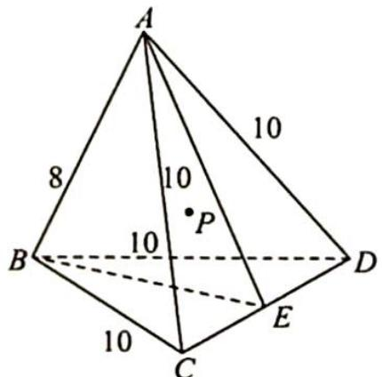
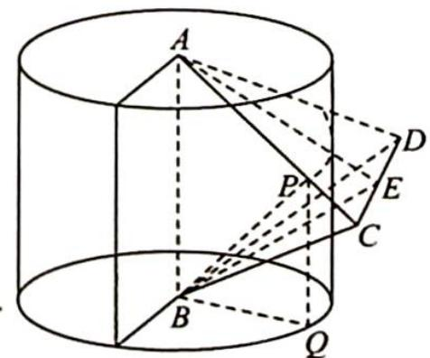
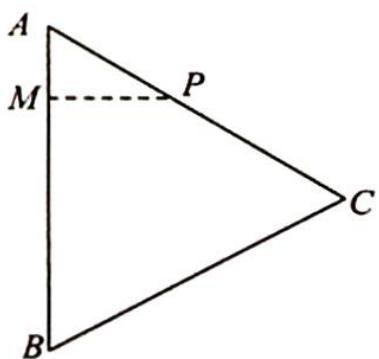

> [!faq]- 《高考数学培优40讲》例题解析
>
> > [!success]- **【答案】** 详见解析
>
> > [!note]- **【分析】**
> > 分析 ▶ 由题意可得点 P 在以 AB 为轴心线的圆柱面上, 所以点 P 的轨迹是圆柱面与平面 ACD 的交线.
>
> > [!note]- **【解析】**
> > 解析 因为 P 到直线 AB 的距离为 $\sqrt{21}$ ，所以 P 的轨迹在半径为 $\sqrt{21}$ 的圆柱面。
> > 设点 $P$ 在圆柱底面上的射影为点 $Q$ , 如图 1 所示, 设 $E$ 为 $CD$ 中点, 根据数量关系得 $\triangle ABE$ 为等边三角形, 如图 2 所示, 在 $\triangle BQP$ 中, $BP^{2} = BQ^{2} + PQ^{2}$ , 所以当 $P$ 越靠上, $PQ$ 越大, $BP$ 越大, 根据圆柱的对称性以及等腰三角形的对称性可得, 当 $P$ 在边 $AC$ 或 $AD$ 上时最大, 以 $P$ 在 $AC$ 上为例, 易求得 $\cos \angle BAC = \frac{2}{5}$ , 过点 $P$ 向 $AB$ 作垂线, 垂足为点 $M$ , 如图 3 所示. 此时 $PM = \sqrt{21}$ , 可求得 $AM = 2$ , 所以 $BM = 6$ , 此时 $PB = \sqrt{57}$ .
> > 
> > 图1
> > 
> > 图2
> > 
> > 图3
> > ## 评注
> > 本题关键是借助圆柱确定 P 点轨迹.
