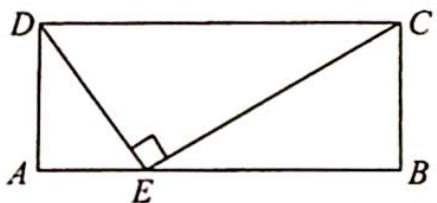
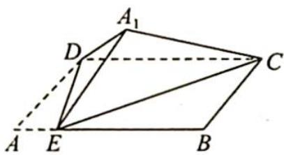
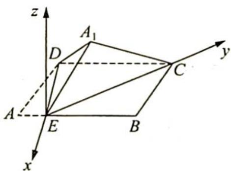

> [!faq]- 《高考数学培优40讲》例题解析
>
> > [!success]- **【答案】** C
>
> > [!note]- **【分析】**
> > 本题未单列分析。
>
> > [!note]- **【解析】**
> > 
> > 图 1
> > 
> > 图 2
> > 解析 ①: 当平面 $A_{1}DE \perp$ 平面 $CDE$ 时, 平面 $A_{1}DE \cap$ 平面 $CDE = DE$ , 因为 $CE \perp DE$ , 则 $CE \perp$ 平面 $A_{1}DE$ , 则 $CE \perp DA_{1}$ , 故①正确.
> > - **②**：若存在某个位置, 使 $DE \perp A_{1} C$ , 因为 $DE \perp E C$ , 所以 $DE \perp$ 平面 $A_{1} E C, D E \perp A_{1} E$ , 即 $D E \perp A E$ , 与 $\angle D E A$ 为锐角相矛盾, 所以 ② 错误.
> > - **③**：以 E 为原点, $\overrightarrow{DE}$ 为 x 轴正方向, $\overrightarrow{EC}$ 为 y 轴正方向, 过 E 垂直于底面 DEBC 向上的向量为 z 轴正方向, 建立空间直角坐标系, 如图所示. 则 $A_{1}\left(-\frac{1}{2}, -\frac{\sqrt{3}}{2}\cos\theta, \frac{\sqrt{3}}{2}\sin\theta\right), C(0, 2\sqrt{3}, 0)$ , 所以 $\overrightarrow{A_{1}C} = \left(\frac{1}{2}, 2\sqrt{3} + \frac{\sqrt{3}}{2}\cos\theta, -\frac{\sqrt{3}}{2}\sin\theta\right), \overrightarrow{DE} = (2, 0, 0)$ .
> > 
> > 设两直线夹角为 $\varphi$ ，则 $\cos \varphi = \frac{1}{2\sqrt{\left(\frac{1}{2}\right)^2 + \left(2\sqrt{3} + \frac{\sqrt{3}}{2}\cos\theta\right)^2 + \left(-\frac{\sqrt{3}}{2}\sin\theta\right)^2}} = \frac{1}{2\sqrt{13 + 6\cos\theta}}.$
> > 又 $\cos\varphi$ 是关于 $\theta$ 的增函数, 故任意两个位置, 直线 DE 和直线 $A_{1}C$ 所成的角都不相等, 所以③正确.
> > 综上所述，①③正确，
> >
> > 故选 **C**.
