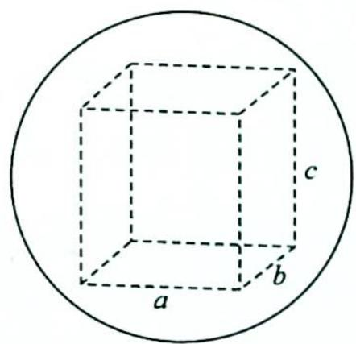
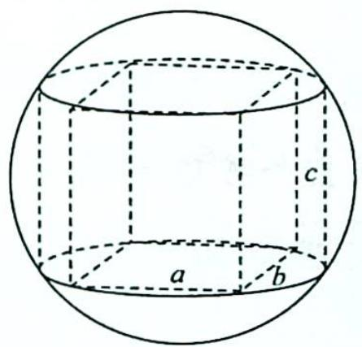
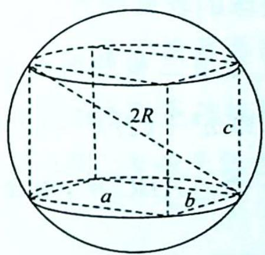

36.1 长方体模型

## 研究密钥

类型一: 长方体模型

题设: 求长方体外接球的半径.

方法:如图所示,长方体的体对角线即为其外接球的直径,体对角线的中点即为球心;设长、宽、高分别为a,b,c,直接用公式 $(2R)^{2}=a^{2}+b^{2}+c^{2}$ ,即 $2R=\sqrt{a^{2}+b^{2}+c^{2}}$ ,求出R.

![[高中/总复习/专题/高考数学培优40讲/高考数学培优40讲-04-立体几何与概率统计/第36讲_球体及几何体模型应用/柱体外接球问题/36_1_长方体模型/例题/Q00020090.md]]
