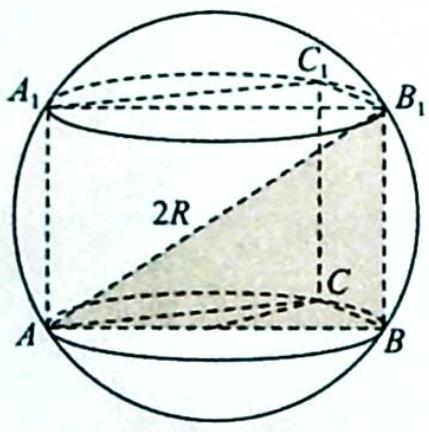
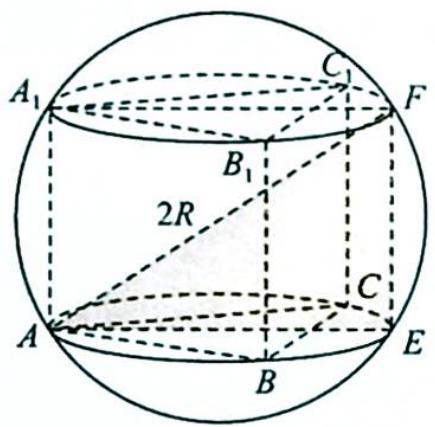
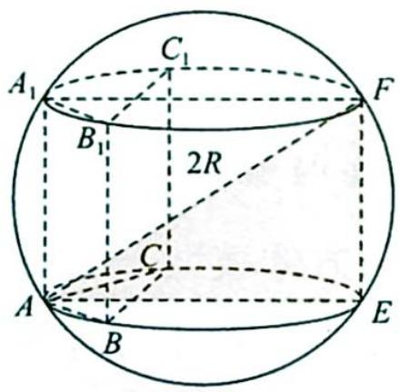

# 36.2 汉堡模型

## 研究密钥

类型二: 汉堡模型

题设: 求直棱柱外接球的半径.

方法:如果在圆柱上下底面对应位置处取相同数量的点,比如都取三个点,便可以得到直三棱柱,它的外接球其实就是这个圆柱的外接球,所以说求直棱柱的外接球半径符合这个模型.

如图所示,在圆柱的外接球中,母线即为高线,设为h,底面圆即为截面圆,设底面圆的半径为r,球体的半径为R,则有 $r^{2}+\left(\frac{h}{2}\right)^{2}=R^{2}$ ,将棱柱内接于某个圆柱中,即可求解.

![[高中/总复习/专题/高考数学培优40讲/高考数学培优40讲-04-立体几何与概率统计/第36讲_球体及几何体模型应用/柱体外接球问题/36_2_汉堡模型/例题/Q00020091.md]]
