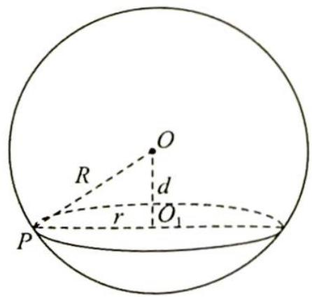
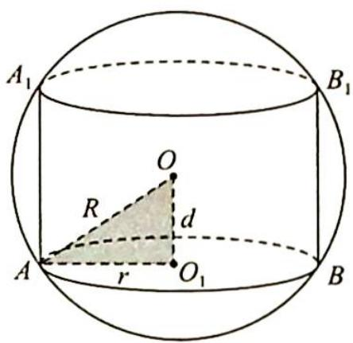
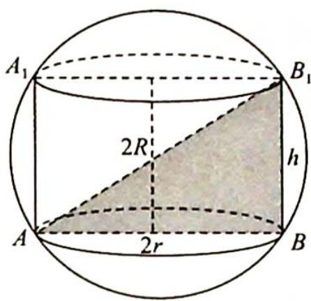

# 第36讲

# 球体及几何体模型应用

立体几何作为高考数学的重要考查模块之一, 每年的卷面分值相对稳定, 一般是 22 分, 即 “2 小 1 大” (2 道小题、1 道大题). 球体是空间几何体中比较特殊的旋转体之一, 也常以压轴小题的形式进行考查. 本讲针对球体的特殊性, 尤其是球体的重要性质 (类比圆的垂径定理) 在空间几何体的外接球半径求解问题上的应用进行深度剖析, 希望可以帮助同学们解决外接球问题.

我们先从球的基本定义与性质入手,然后探究外接球与内切球的几种模型.

## 一、球体的有关定义

1. 球面的定义: 以半圆的直径所在的直线为旋转轴, 旋转一周形成的曲面叫球面. 也可理解为空间中到定点的距离等于定长的点的集合叫球面.

2. 球体的定义: 球面所围成的旋转体叫作球体, 简称球.

3. 外接球的定义: 若一个多面体的各个顶点都在一个球的球面上, 则称这个多面体是这个球的内接多面体, 这个球是这个多面体的外接球.

4. 内切球的定义: 若一个多面体的各面都与一个球的球面相切, 则称这个多面体是这个球的外切多面体, 这个球是这个多面体的内切球.

5.棱切球的定义:若一个多面体的所有棱都与一个球的球面相切,则称这个球是这个多面体的棱切球.

6. 大圆的定义: 经过球心的平面与球面相交所得的圆是球的大圆.

7. 小圆的定义: 不经过球心的平面与球面相交所得的圆是球的小圆.

## 二、球体的有关性质

如图所示, 在球 $O$ 中, 圆 $O_{1}$ 是截面小圆, 点 $P$ 为圆 $O_{1}$ 上的点, 则 $O_{1} P^{2} + O_{1} O^{2} = O P^{2}$ , 即 $r^{2} + d^{2} = R^{2}$ . (其中 $r$ 表示截面圆的半径, $d$ 表示球心到截面的距离, $R$ 表示球的半径)

如图 1 所示是一个底面半径为 r，高为 h 的圆柱，求它的外接球半径。图 2 将作为基础图形来理解并运用。

图 1

图 2
![[高中/总复习/专题/高考数学培优40讲/高考数学培优40讲-04-立体几何与概率统计/第36讲_球体及几何体模型应用/柱体外接球问题/柱体外接球问题.md]]
![[高中/总复习/专题/高考数学培优40讲/高考数学培优40讲-04-立体几何与概率统计/第36讲_球体及几何体模型应用/锥体外接球问题/锥体外接球问题.md]]
![[高中/总复习/专题/高考数学培优40讲/高考数学培优40讲-04-立体几何与概率统计/第36讲_球体及几何体模型应用/内切球问题/内切球问题.md]]
![[高中/总复习/专题/高考数学培优40讲/高考数学培优40讲-04-立体几何与概率统计/第36讲_球体及几何体模型应用/几何体模型应用问题/几何体模型应用问题.md]]
![[高中/总复习/专题/高考数学培优40讲/高考数学培优40讲-04-立体几何与概率统计/第36讲_球体及几何体模型应用/训练_36/训练_36.md]]
