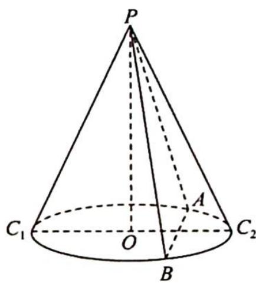

<!-- question-source:start -->
4.(多选题)如图所示,已知三棱锥 P-ABC 的所有面均为等腰三角形, $\triangle ABC$ 的外接圆半径为 1, $AB=\sqrt{3}$ , 侧棱长均为 3, 则该三棱锥的体积
为( ).
A. $\frac{\sqrt{6}}{6}$ B. $\frac{\sqrt{6}}{2}$ C. $\sqrt{6}$ D. $\frac{3\sqrt{6}}{2}$

<!-- question-source:end -->

![[Q00020112A1]]
