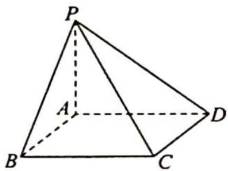

<!-- question-source:start -->
6. 在《九章算术》中, 将底面为矩形且有一条侧棱与底面垂直的四棱锥称为阳马, 如图所示, 若四棱锥 $P-ABCD$ 为阳马, 侧棱 $PA \perp$ 底面 $ABCD$ , 且 $PA=3$ , $BC=AB=4$ . 设该阳马的外接球半径为 $R$ , 内切球半径为 $r$ , 则 $\frac{R}{r}=$ \_\_\_\_.

<!-- question-source:end -->

![[Q00020114A1]]
