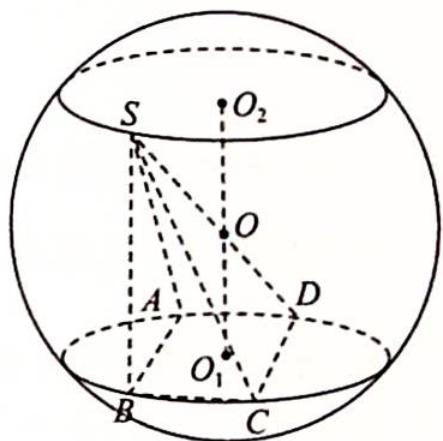

> [!faq]- 《高考数学培优40讲》参考答案
>
> > [!success]- **【答案】** A
>
> > [!note]- **【分析】**
> > 本题未单列分析。
>
> > [!note]- **【解析】**
> > 由题意知,点 S 的轨迹是平行于平面 ABCD 的截面圆,OS=OD=1,所以 $OO_{1}=OO_{2}$ , 即球心 O 到平面 ABCD 的距离等于到 $\odot O_{2}$ 的距离, 如图所示,则 $O_{2}S=\frac{\sqrt{2}}{2},|SO_{1}|=\sqrt{O_{1}O_{2}^{2}+O_{2}S^{2}}=\sqrt{2+\frac{1}{2}}=\frac{\sqrt{10}}{2}$ . 故选 A.
> > 【评注】球体性质的关键 $r^{2}+d^{2}=R^{2}$ (其中 r 表示截面圆的半径, d 表示球心到截面的距离, R 表示球的半径).
> > 
