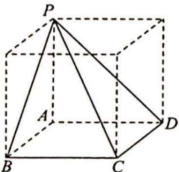
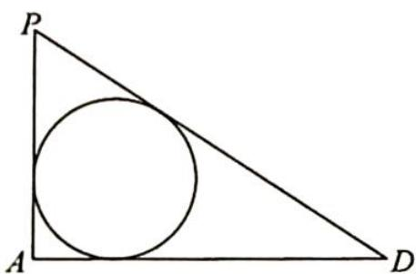

> [!faq]- 《高考数学培优40讲》参考答案
>
> > [!success]- **【答案】** 详见解析
>
> > [!note]- **【分析】**
> > 本题未单列分析。
>
> > [!note]- **【解析】**
> > 如图1所示,设该阳马的外接球半径为R,所以该阳马补形得到的长方体的对角线即为外接球的直径,有 $(2R)^{2}=AB^{2}+AD^{2}+AP^{2}=16+16+9=41$ ,即 $R=\frac{\sqrt{41}}{2}$ .
> > 
> > 图1
> > 
> > 图2
> > 因为侧棱 $PA \perp$ 底面 $ABCD$ , 且底面为正方形, 所以内切球 $O_{1}$ 在侧面 $PAD$ 内的正视图是 $\triangle PAD$ 的内切圆, 如图 2 所示, 因为内切球半径为 $r = \frac{a + b - c}{2} = 1$ (直角三角形的内切圆半径), 即 $\frac{R}{r} = \frac{\sqrt{41}}{2}$ .
> > 【评注】因为本题的内切圆半径是特殊三角形的内切圆,所以可以比较快速地求解,如果是一般的棱锥,可以用 $r=\frac{3V}{S}$ 来求解.
