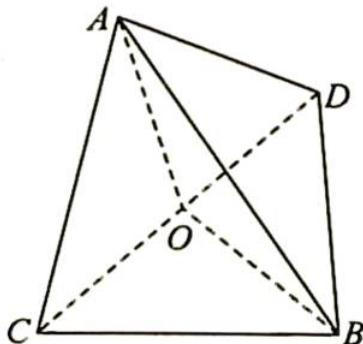

> [!faq]- 《高考数学培优40讲》参考答案
>
> > [!success]- **【答案】** 详见解析
>
> > [!note]- **【分析】**
> > 本题未单列分析。
>
> > [!note]- **【解析】**
> > 如图所示,由题意可知三棱锥的四个面全等,且每一个面的面积均为 $\frac{1}{2}\times6\times4=12$ .
> > 设三棱锥的内切球的半径为 r，则三棱锥的体积 $V=\frac{1}{3}S_{\triangle ABC} \cdot r \cdot 4=16r$ .
> > 取 CD 的中点 O，连接 AO, BO，则 $CD \perp$ 平面 AOB, AO = BO = 4, $S_{\triangle AOB} = \frac{1}{2} \times 6 \times \sqrt{7} = 3\sqrt{7}$ .
> > 
> > 所以 $V_{A-BCD}=2V_{C-AOB}=2\times\frac{1}{3}\times3\sqrt{7}\times3=6\sqrt{7},16r=6\sqrt{7}$ ，解得 $r=\frac{3\sqrt{7}}{8}$ 。故内切球的表面积为 S= $4\pi r^{2}=\frac{63\pi}{16}$ 。
