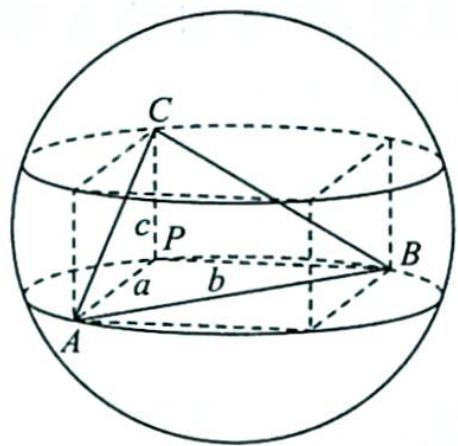
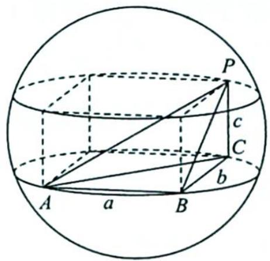
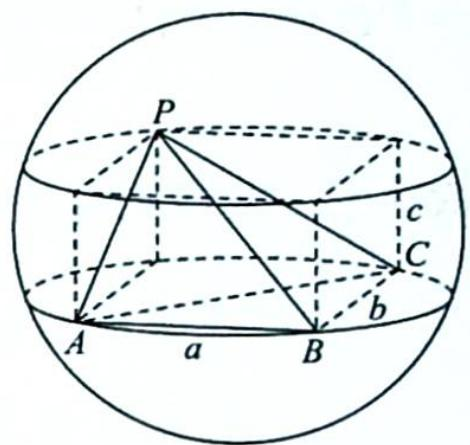

# 36.3 墙角模型

## 研究密钥

类型三: 墙角模型

题设: 求三条棱两两垂直的三棱锥的外接球半径.

方法:如图所示,补形为长方体模型,将三棱锥嵌入长方体模型中,直接用公式 $(2R)^{2}=a^{2}+b^{2}+c^{2}$ ,即 $2R=\sqrt{a^{2}+b^{2}+c^{2}}$ ,求出R.

![[高中/总复习/专题/高考数学培优40讲/高考数学培优40讲-04-立体几何与概率统计/第36讲_球体及几何体模型应用/锥体外接球问题/36_3_墙角模型/例题/Q00020092.md]]
