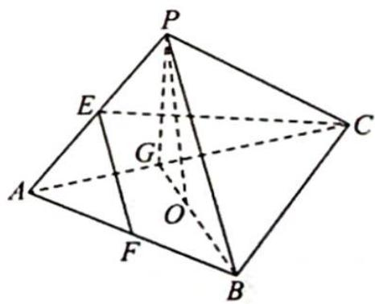
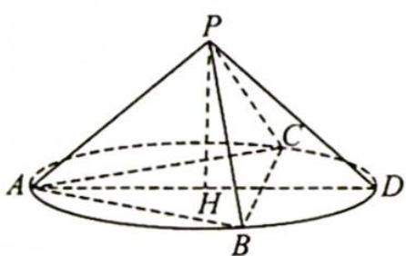
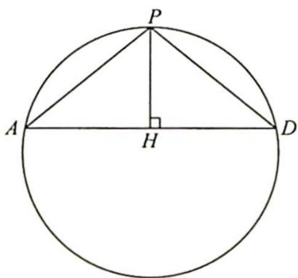

> [!faq]- 《高考数学培优40讲》例题解析
>
> > [!success]- **【答案】** D
>
> > [!note]- **【分析】**
> > 分析 ▶ 思路一: 分析线面位置关系得到三棱锥 P-ABC 的三条侧棱两两垂直. 把三棱锥补形为正方体, 则正方体外接球即为三棱锥的外接球, 其直径为正方体的体对角线的长度.
> >
> > 思路二: 求三棱锥 P-ABC 外接球的大圆, 故将正三棱锥 P-ABC 内嵌于圆锥中, 设底面外接圆的直径为 AD, 则 $\triangle PAD$ 的外接圆即为外接球的大圆.
>
> > [!note]- **【解析】**
> > 解析 ▶ 解法一:(墙角模型)由题意可知三棱锥 P-ABC 为正三棱锥, 如图 1 所示, 取 AC 的中点为 G, 连接 BG, PG, 则 $AC \perp BG$ , 又 $PG \perp AC, PG \cap BG = G$ , 可得 $AC \perp$ 平面 PBG, 则 $PB \perp AC$ . 因为 E, F 分别是 PA, AB 的中点, 所以 $EF \parallel PB$ .
> > 
> > 图1
> > 又 $\angle CEF=90^{\circ}$ ,即 $EF\perp CE$ ,所以 $PB\perp CE$ ,可得 $PB\perp$ 平面 $PAC$ ,则 $PB\perp PA,PB\perp PC$ .
> > 又因为 PA=PB=PC, $\triangle ABC$ 是正三角形, 所以 $\triangle PAC \cong \triangle PBC \cong \triangle PAB$ , 故 $PA \perp PC$ ,
> > 所以正三棱锥 P-ABC 的三条侧棱两两垂直.
> > 把三棱锥补形为正方体, 则正方体外接球即为三棱锥的外接球, 其直径为正方体的体对角线的长度, 即 $d = \sqrt{PA^2 + PB^2 + PC^2} = \sqrt{6}$ , 半径为 $\frac{\sqrt{6}}{2}$ , 则球 $O$ 的体积 $V = \frac{4}{3}\pi \times \left(\frac{\sqrt{6}}{2}\right)^3 = \sqrt{6}\pi$ . 故选 D.
> > 解法二:(切瓜模型)由题得 $PA = PB = PC = \sqrt{2}$ , AB = BC = CA = 2.
> > 如图2所示,正三棱锥P-ABC内嵌于圆锥中,设底面圆H的直径为AD,易知 $AD=\frac{2}{\sin60^{\circ}}$ $=\frac{4}{\sqrt{3}}$ , $\triangle PAD$ 的外接圆即为三棱锥 P-ABC 外接球的大圆, 如图 3 所示.
> > 因为 $PA = PD = \sqrt{2}$ , $AD = \frac{4}{\sqrt{3}}$ , 所以 $PH = \frac{\sqrt{2}}{\sqrt{3}}$ , 则球 O 的直径, 即大圆的直径 $2R = \frac{\sqrt{2}}{\sin A} = \frac{\sqrt{2}}{\sqrt{3}} = \sqrt{6}$ , $R = \frac{\sqrt{6}}{2}$ , 球 O 的体积 $V = \frac{4}{3}\pi R^{3} = \sqrt{6}\pi$ . 故选 D.
> > 
> > 图 2
> > 
> > 图3
> > ## 评注
> > 解法一也可以通过数量关系求出 $PA = PB = PC = \sqrt{2}$ , 再把三棱锥补形为正方体, 则正方体外接球即为三棱锥的外接球.
