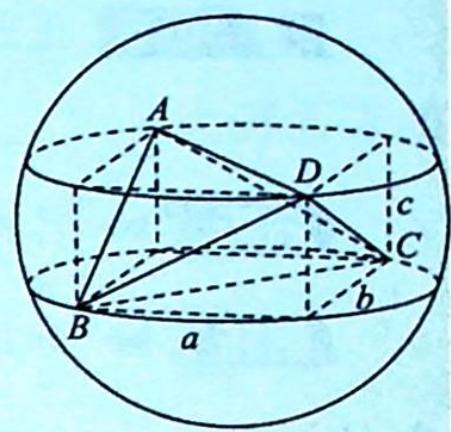

## 36.4 对棱相等模型

## 研究密钥

## 类型四: 对棱相等模型

题设:三棱锥(即四面体)中,已知三组对棱分别相等,求外接球半径(AB=CD,AD=BC,AC=BD).

方法:①画出一个长方体,标出三组互为异面直线的对角线.

②设长方体的长、宽、高分别为 a, b, c, AD = BC = x, AB = CD = y, AC = BD = z，列方程组 $\left\{\begin{aligned}a^{2}+b^{2}&=x^{2}\\ b^{2}+c^{2}&=y^{2}\end{aligned}\right.\Rightarrow(2R)^{2}=a^{2}+b^{2}+c^{2}=\frac{x^{2}+y^{2}+z^{2}}{2}.$ $c^{2}+a^{2}=z^{2}$

补充:如图所示, $V_{A-BCD}=abc-\frac{1}{6}abc\cdot4=\frac{1}{3}abc.$

③根据墙角模型可得 $2R = \sqrt{a^{2} + b^{2} + c^{2}} = \sqrt{\frac{x^{2} + y^{2} + z^{2}}{2}}$ , $R^{2} = \frac{x^{2} + y^{2} + z^{2}}{8}$ , $R = \sqrt{\frac{x^{2} + y^{2} + z^{2}}{8}}$ , 求出 R.

![[高中/总复习/专题/高考数学培优40讲/高考数学培优40讲-04-立体几何与概率统计/第36讲_球体及几何体模型应用/锥体外接球问题/36_4_对棱相等模型/例题/Q00020093.md]]
