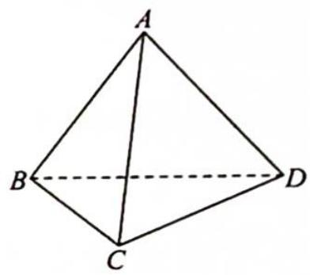
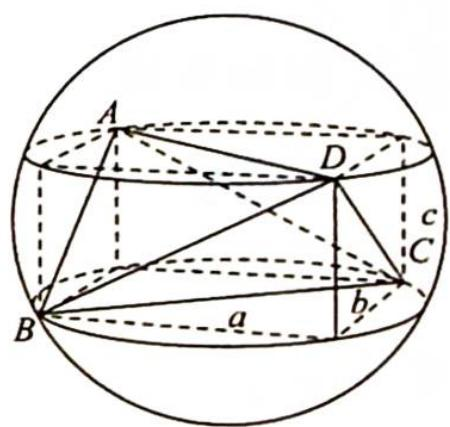

> [!faq]- 《高考数学培优40讲》例题解析
>
> > [!success]- **【答案】** 详见解析
>
> > [!note]- **【分析】**
> > 分析 ▶ 对棱相等的三棱锥可以内嵌于长方体中. 设长、宽、高分别为 a, b, c，利用 $(2R)^{2}=a^{2}+b^{2}+c^{2}=\frac{x^{2}+y^{2}+z^{2}}{2}$ ，求三棱锥外接球半径.
> >
> > 
>
> > [!note]- **【解析】**
> > 解析 如图所示, 将三棱锥补形为长方体, 三个长度为三对面的对角线长, 设长、宽、高分别为 $a, b, c$ , 则 $a^2 + b^2 = 49, b^2 + c^2 = 25, c^2 + a^2 = 36$ , 所以 $2(a^2 + b^2 + c^2) = 25 + 36 + 49 = 110$ .
> > 设三棱锥外接球半径为 R，则 $4R^{2}=55$ ，因此表面积 $S=4\pi R^{2}=55\pi$ .
> > 
