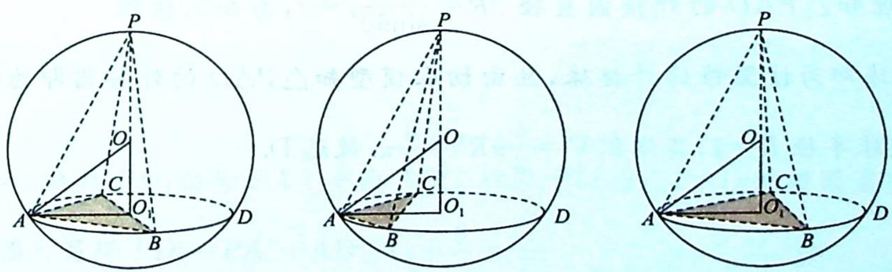

## 36.5 切瓜模型

## 研究密钥

类型五: 切瓜模型

题设:如图所示,P 的射影 $O_{1}$ 是 $\triangle ABC$ 的外心 $\Leftrightarrow$ 三棱锥 P-ABC 的三条侧棱相等 $\Leftrightarrow$ 三棱锥 P-ABC 的底面 $\triangle ABC$ 在圆锥的底上,顶点 P 也是圆锥的顶点.

方法:①确定球心 O 的位置,取 $\triangle ABC$ 的外心 $O_{1}$ , 则 P, O, $O_{1}$ 三点共线.

②先算出小圆 ${O}_{1}$ 的半径 $A{O}_{1} = r$ ,再算出棱锥的高 $P{O}_{1} = h$ (也是圆锥的高).

③勾股定理: $OA^{2} = O_{1}A^{2} + O_{1}O^{2} \Rightarrow R^{2} = r^{2} + (h - R)^{2}$ , 解出 $R$ .

![[高中/总复习/专题/高考数学培优40讲/高考数学培优40讲-04-立体几何与概率统计/第36讲_球体及几何体模型应用/锥体外接球问题/36_5_切瓜模型/例题/Q00020094.md]]
![[高中/总复习/专题/高考数学培优40讲/高考数学培优40讲-04-立体几何与概率统计/第36讲_球体及几何体模型应用/锥体外接球问题/36_5_切瓜模型/例题/Q00020095.md]]
