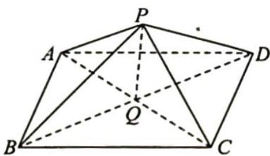

> [!faq]- 《高考数学培优40讲》例题解析
>
> > [!success]- **【答案】** 详见解析
>
> > [!note]- **【分析】**
> > 本题未单列分析。
>
> > [!note]- **【解析】**
> > 解析 如图所示, 连接 AC, BD 交于点 Q, PQ⊥底面 ABCD, 且 PQ=1.
> > 
> > 又 $AB = 2\sqrt{3}$ ，在 $\triangle PAC$ 中， $AC = 2\sqrt{6},PA = PC = \sqrt{7},\sin \angle APC =$ $2\sin \angle APQ\cos \angle APQ = 2\times \frac{\sqrt{6}}{\sqrt{7}}\times \frac{1}{\sqrt{7}} = \frac{2\sqrt{6}}{7}.$
> > 由正弦定理可知 $2R=\frac{AC}{\sin\angle APC}=\frac{2\sqrt{6}}{\frac{2\sqrt{6}}{7}}=7.$
> > 由切瓜模型可知 $\triangle APC$ 的外接圆即为该球的大圆,故该球的表面积 $S=4\pi R^{2}=49\pi$ .
