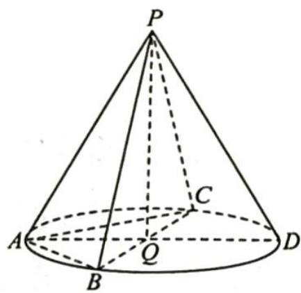

> [!faq]- 《高考数学培优40讲》例题解析
>
> > [!success]- **【答案】** D
>
> > [!note]- **【分析】**
> > 分析 ▶ 根据 PA = PB = PC 可借助圆锥的对称性求解.
>
> > [!note]- **【解析】**
> > 解析 如图所示,设圆锥的顶点为 P,底面圆心为 Q,母线 PA 与底面圆 Q 所成角大小为 $60^{\circ}$ .
> > B,C 为圆 Q 上异于点 A 的两个点,AD 为底面圆 Q 的直径. 因为 $PA=\sqrt{3}$ , $\angle PAD=60^{\circ}$ , 所以 $PD=AD=\sqrt{3}$ , 故 $\triangle PAD$ 为等边三角形.
> > 
> > 由正弦定理知 $\triangle PAD$ 的外接圆直径 $2R = \frac{\sqrt{3}}{\sin 60^\circ} = 2$ , 易知三棱锥
> > P-ABC的外接球即为该圆锥的外接球,且由切瓜模型知 $\triangle PAD$ 的外接圆即为该外接球的大圆,所以该外接球半径R=1,其体积 $V=\frac{4}{3}\pi R^{3}=\frac{4}{3}\pi$ .
> >
> > 故选 **D**.
