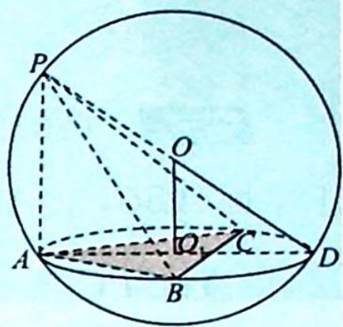

## 36.6 垂面模型

## 研究密钥

## 类型六:垂面模型

题设:如图所示, $PA\perp$ 平面 ABC,求外接球半径.

方法:①将 $\triangle ABC$ 画在小圆面上,A为小圆直径的一个端点,作小圆的直径AD,连接PD,则PD必过球心O.

② $O_{1}$ 为△ABC的外心,所以 $OO_{1}\perp$ 平面ABC,算出小圆 $O_{1}$ 的半径 $O_{1}D=r$ (三角形的外接圆直径算法:利用正弦定理得 $\frac{a}{\sin A}=\frac{b}{\sin B}=\frac{c}{\sin C}=2r$ ), $OO_{1}=\frac{1}{2}PA$ .

③利用勾股定理求三棱锥的外接球半径: $(2R)^{2} = PA^{2} + (2r)^{2} \Leftrightarrow 2R = \sqrt{PA^{2} + (2r)^{2}}$ ; $R^{2} = r^{2} + OO_{1}^{2} \Leftrightarrow R = \sqrt{r^{2} + OO_{1}^{2}}$ .

![[高中/总复习/专题/高考数学培优40讲/高考数学培优40讲-04-立体几何与概率统计/第36讲_球体及几何体模型应用/锥体外接球问题/36_6_垂面模型/例题/Q00020096.md]]
![[高中/总复习/专题/高考数学培优40讲/高考数学培优40讲-04-立体几何与概率统计/第36讲_球体及几何体模型应用/锥体外接球问题/36_6_垂面模型/例题/Q00020097.md]]
