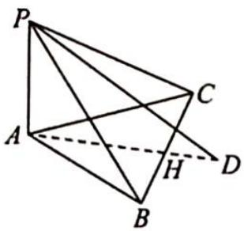
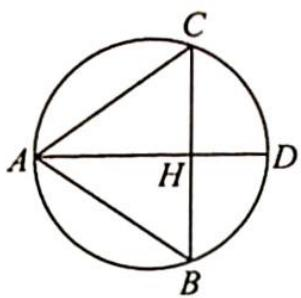

> [!faq]- 《高考数学培优40讲》例题解析
>
> > [!success]- **【答案】** 详见解析
>
> > [!note]- **【分析】**
> > 分析 ▶ 分析棱 PA, PB, PC 的位置关系可得 PA ⊥ 平面 ABC, 有高线, 找大圆. 设 A 为小圆直径的一个端点, 作小圆的直径 AD, 连接 PD, 则 PD 为 $\triangle PAD$ 外接圆直径, 即大圆直径.
>
> > [!note]- **【解析】**
> > 解析 如图1所示, 在 $\triangle PAB$ 中, 因为 $PA=1, PB=2, \angle APB=60^{\circ}$ , 所以 $AB=\sqrt{3}$ , $\angle PAB=90^{\circ}, PA \perp AB$ . 同理 $PA \perp AC, AC=\sqrt{3}$ .
> > 又 $\triangle PBC$ 为等边三角形, $\triangle ABC$ 为等腰三角形.在 $\triangle ABC$ 中,取 $BC$ 中点 $H$ ,如图2所示,连接 $AH$ 并延长交 $\triangle ABC$ 外接圆于点 $D$ .
> > 由正弦定理可得 $\frac{AB}{\sin\angle ACB} = 2r = AD$ ，则 $\sin \angle ACB = \frac{AH}{AC} = \frac{\sqrt{2}}{\sqrt{3}} = \frac{\sqrt{6}}{3}$ ，所以 $AD = \frac{\sqrt{3}}{\frac{\sqrt{6}}{3}} = \frac{3\sqrt{2}}{2}$ .
> > 如图1所示,连接 $PD$ , 因为 $PA \perp$ 平面 $ABC$ , 所以 $PD$ 为 $\triangle PAD$ 外接圆直径, 即大圆直径 (有高线, 找大圆). 另得 $PD^{2} = PA^{2} + AD^{2} = 1 + \frac{9}{2} = \frac{11}{2}$ .
> > 故三棱锥 P-ABC 的外接球的表面积 $S=4\pi R^{2}=\pi \cdot PD^{2}=\frac{11\pi}{2}$ .
> > 
> > 图1
> > 
> > 图2
