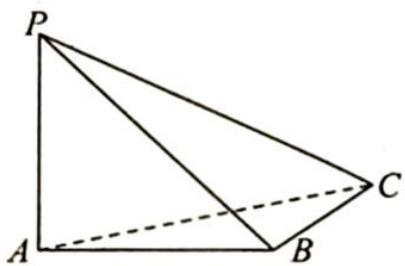
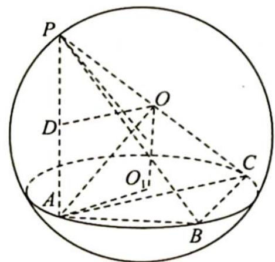

> [!faq]- 《高考数学培优40讲》例题解析
>
> > [!success]- **【答案】** 详见解析
>
> > [!note]- **【分析】**
> > 本题未单列分析。
>
> > [!note]- **【解析】**
> > 
> > 解析 如图所示, 设 $O_{1}$ 为 $\triangle ABC$ 的外心, $O$ 为三棱锥 $P-ABC$ 外接球的球心.
> > 由 $PA \perp$ 平面 $ABC, OO_1 \perp$ 平面 $ABC$ 可知 $PA \parallel OO_1$ .
> > 取 $PA$ 的中点 $D$ , 由 $OP = OA = 2\sqrt{2}$ 知 $OD \perp PA$ , 故四边形 $DAO_{1}O$ 为矩形.
> > 又 $PA = 4$ ，则 $O_{1}O = AD = 2$ ，从而 $\triangle ABC$ 外接圆的半径 $r = O_{1}A = 2$
> > 
> > 在 $\triangle ABC$ 中,根据正弦定理有 $\frac{AC}{\sin\angle ABC}=2r$ ,可得 $AC=2\sqrt{3}$ .
> > 所以直线 $PC$ 与平面 $ABC$ 所成角的正切值 $\tan \angle PCA = \frac{PA}{AC} = \frac{2\sqrt{3}}{3}$ .
> > ## 评注
> > 球体性质的关键公式为 $r^2 + d^2 = R^2$ ，其中 $r$ 表示截面圆的半径， $d$ 表示球心到截面的距离， $R$ 表示球的半径。
