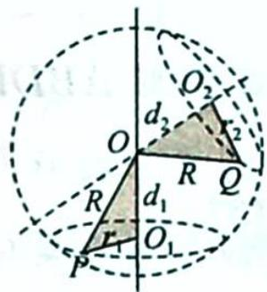
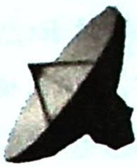

## 36.7 折叠问题

## 研究密钥

## 类型七:折叠模型

简单多面体的外接球问题实质就是定位球心 O 的位置, 根据球的截面圆的性质, 球心必在过截面圆圆心的垂线上, 所以只需找到两个截面圆的圆心, 也就是截面多边形的外心, 过圆心 (外心) 作出截面圆的垂线, 两条垂线必相交于一点, 即球心, 构建以球心、截面圆圆心 (外心)、多面体的顶点围成的两个直角三角形, 其中三条边长分别是球心到截面的距离为 $d$ , 截面圆的半径为 $r$ , 球的半径为 $R$ , 则 $d^{2} + r^{2} = R^{2}$ (图 1), 趣称为“(外)心(球)心相印”法, 方便学生理解和记忆 (类比卫星定位图 2), 即通过截面圆圆心 (外心) 定位球心将立体几何问题转化为平面问题, 简记: 两心两线两勾股.

图 1

图2

![[高中/总复习/专题/高考数学培优40讲/高考数学培优40讲-04-立体几何与概率统计/第36讲_球体及几何体模型应用/锥体外接球问题/36_7_折叠问题/例题/Q00020098.md]]
![[高中/总复习/专题/高考数学培优40讲/高考数学培优40讲-04-立体几何与概率统计/第36讲_球体及几何体模型应用/锥体外接球问题/36_7_折叠问题/例题/Q00020099.md]]
