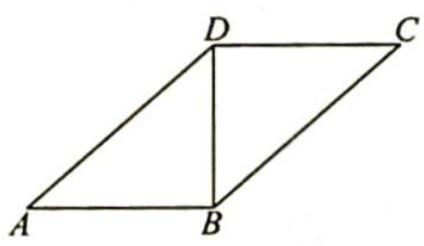
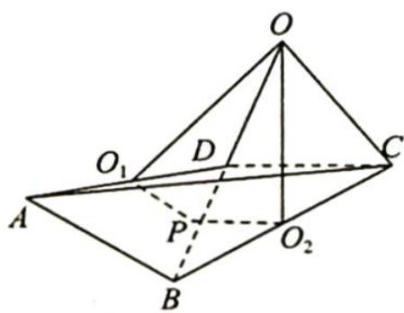
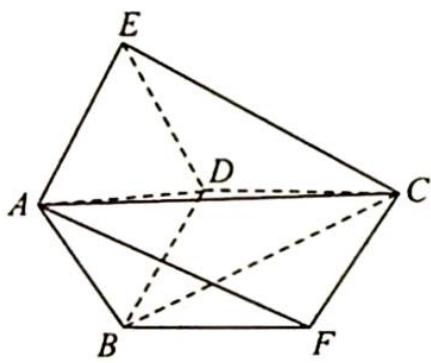
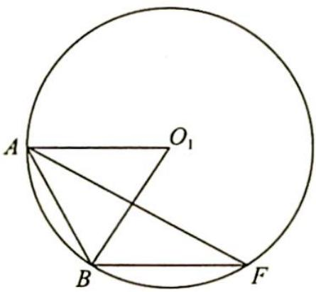

> [!faq]- 《高考数学培优40讲》例题解析
>
> > [!success]- **【答案】** 详见解析
>
> > [!note]- **【分析】**
> > 分析 ➤ 思路一:折叠后,找到△ABD 和 △BDC 截面圆的圆心,也是它们的外心,过圆心作截面圆的垂线,两条垂线相交于一点,即球心.在球心、截面圆圆心(外心)、多面体的顶点围成的直角三角形中求外接球的半径.
> >
> > 思路二: 将折叠的两面的三角形扩展为正方形, 这样三棱锥 A-BCD 的外接球转化为求一个直三棱柱的外接球, 用 $R = \sqrt{r^{2} + d^{2}}$ 求半径.
>
> > [!note]- **【解析】**
> > 解析 ▶ 解法一: 如图 1 所示, 易知 Rt△ABD≌Rt△CDB, 将△ABD 沿 BD 折起后, 连接 AC, 形成三棱锥 A-BCD, 如图 2 所示.
> > 
> > 图1
> > 
> > 图 2
> > 设三棱锥的外接球球心为 O，则平面 ABD 和平面 BDC 截球得到小圆，设小圆圆心分别为 $O_{1}, O_{2}$ ，则 $O_{1}$ 为 AD 中点， $O_{2}$ 为 BC 中点。
> > 过 $O_{1}, O_{2}$ 分别作平面 ABD 和平面 BDC 的垂线, 交点为球心 O, 取 BD 中点 P, 连接 $O_{1}P$ , $O_{2}P$ , 则 $\angle O_{1}PO_{2} = \frac{2\pi}{3}$ , 且 $O, O_{1}, O_{2}, P$ 四点共面.
> > 在四边形 $OO_{1}PO_{2}$ 中， $O_{1}P = O_{2}P = 1, OO_{1} \perp O_{1}P, OO_{2} \perp O_{2}P$ ，所以 $\angle O_{1}OO_{2} = \frac{\pi}{3}$ .
> > 连接 OP, OC, 易知 Rt $\triangle OO_{2}P$ 中, $OO_{2}=\sqrt{3}$ , 再由勾股定理知 $OC=\sqrt{OO_{2}^{2}+O_{2}C^{2}}=\sqrt{(\sqrt{3})^{2}+(\sqrt{2})^{2}}=\sqrt{5}$ , 即三棱锥 A-BCD 的外接球半径 $R=\sqrt{5}$ , 所以该球体的表面积 S=4πR²=20π.
> > 解法二:如图3所示,将等腰Rt△ABD扩展为正方形ABDE,将△BDC扩展为正方形BDCF,连接CF,AE,AF,EC,易证三棱柱ABF-EDC为直三棱柱.
> > 三棱锥 A-BCD 的外接球即为该直三棱柱 ABF-EDC 的外接球, 又 BD=2 , 所以球心到截面 ABF 的距离 d=1 .
> > 因为二面角 A-BD-C 的大小为 $\frac{2\pi}{3}$ ，所以 $\angle ABF = \frac{2\pi}{3}$ .
> > 如图4所示, 设 $\triangle ABF$ 所在截面圆的半径为 $r$ , 圆心为 $O_1$ , 易得 $r = 2$ , 所以外接球的半径 $R = \sqrt{r^2 + d^2} = \sqrt{2^2 + 1^2} = \sqrt{5}$ , 即外接球的表面积为 $4\pi R^2 = 20\pi$ .
> > 
> > 图3
> > 
> > 图 4
