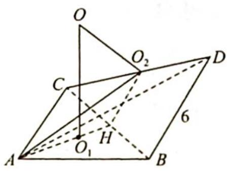
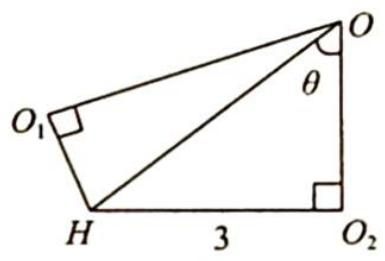

> [!faq]- 《高考数学培优40讲》例题解析
>
> > [!success]- **【答案】** D
>
> > [!note]- **【分析】**
> > 本题未单列分析。
>
> > [!note]- **【解析】**
> > 解析 如图1所示,取BC中点H,连接AH,设 $O_{1},O_{2}$ 分别为 $\triangle ABC,\triangle BCD$ 的外心,
> > 则 $O_{1}H=\sqrt{3}, O_{2}H=3$ . 且 $BC\perp$ 平面 $AO_{2}H$ .
> > 在平面 $AO_{2}H$ 中, 作 $OO_{1} \perp$ 平面 ABC, $OO_{2} \perp$ 平面 BCD, 交点为 O, 则 O 为四面体 ABCD 外接球球心.
> > 如图2所示， $\angle O_{1}HO_{2} = 120^{\circ}$ ，连接 $OH$ 设 $\angle O_2OH = \theta$ ，由正弦定理知 $\frac{3}{\sin\theta} = \frac{OH}{\sin90^{\circ}} =$ $\frac{\sqrt{3}}{\sin(60^{\circ} - \theta)}$ ，所以 $3\sin (60^{\circ} - \theta) = \sqrt{3}\sin \theta$ ，解得 $\tan \theta = 6 - 3\sqrt{3}$ ，则 $OO_{2} = \frac{3}{\tan\theta} = \frac{3}{6 - 3\sqrt{3}} = \frac{1}{2 - \sqrt{3}}$ $= 2 + \sqrt{3},R^{2} = OO_{2}^{2} + O_{2}D^{2} = (2 + \sqrt{3})^{2} + (3\sqrt{2})^{2} = 7 + 4\sqrt{3} +18 = 25 + 4\sqrt{3},S = 4\pi R^{2} =$
> > $(100 + 16\sqrt{3})\pi$ .故选D.
> > 
> > 图1
> > 
> > 图2
> > 
