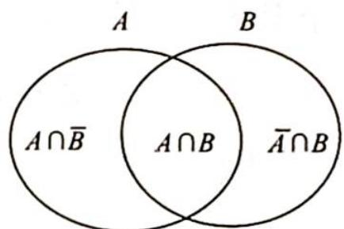

> [!faq]- 《高考数学培优40讲》例题解析
>
> > [!success]- **【答案】** 详见解析
>
> > [!note]- **【分析】**
> > 分析 ▶ 解本题容易想到只要确定一个 $(A,B)$ 对,对调就能得到另外一个对 $(B,A)$ .但是题目中说明当 $A\neq B$ 时, $(A,B)$ 和 $(B,A)$ 视为不同的对,所以简单对调位置容易产生重复计数,最好的办法是以每个对中前面或者后面的一个集合为标准,采用分类加法计数.
>
> > [!note]- **【解析】**
> > 解析 ▶ 解法一(分类记数): 记 $I=\{a_{1}, a_{2}, a_{3}\}$ .
> > - **①**：若 A 是空集, 则 B=I, 有 1 种可能.
> > - **②**：若 $A$ 只含有一个元素, 有 $\mathrm{C}_{3}^{1}$ 种可能, 则 $B$ 可能含有 2 个元素或者 3 个元素. $B$ 含有 2 个元素的情况被 $A$ 唯一确定, 有 $\mathrm{C}_{2}^{2}$ 种; 若 $B$ 含有 3 个元素, 则 $B = I$ . 此时不同的对共有 $\mathrm{C}_{3}^{1}(\mathrm{C}_{2}^{2} +$
> > $C_{3}^{3}$ ) = 6 种.
> > - **③**：若 $A$ 只含有两个元素, 有 $\mathrm{C}_{3}^{2}$ 种可能, 则 $B$ 可能含有 1 个元素或者 2 个元素或者 3 个元素. $B$ 含有 1 个元素的情况被 $A$ 唯一确定, 有 $\mathrm{C}_{1}^{1}$ 种; 若 $B$ 含有 2 个元素, 则其中一个元素必然属于 $A$ , 另一个元素不属于 $A$ , 有 $\mathrm{C}_{2}^{1}$ 种可能; 若 $B$ 含有 3 个元素, 则 $B = I$ . 此时不同的对共有 $\mathrm{C}_{3}^{2} (\mathrm{C}_{1}^{1} + \mathrm{C}_{2}^{1} + \mathrm{C}_{3}^{3}) = 12$ 种.
> > - **④**：若 A 含有三个元素, 则 B 的所有可能有 $C_{3}^{0} + C_{3}^{1} + C_{3}^{2} + C_{3}^{3} = 8$ , 故有 8 种.
> > 综上所述，一共有 $1 + 6 + 12 + 8 = 27$ 种.
> > 解法二(构造模型):由于 $A \cup B = \{a_{1}, a_{2}, a_{3}\}$ , 于是元素 $a_{1}, a_{2}, a_{3}$ 都放在如图所示的三个集合 $A \cap \overline{B}, \overline{A} \cap B$ 和 $A \cap B$ 中 (其中 $\overline{A}$ 表示 $A$ 的补集), 不同的 $(A, B)$ 就由不同的放入方法确定. 每个元素都有 3 种不同的方法, 所以由分步计数原理可得总的方法有 $3^{3} = 27$ 种.
> > 
> > ## 评注
> > 这里巧妙地设计了三个集合, 从而将问题化归为不同球(元素)放入不同盒(集合)这一熟悉的模型, 利用分步乘法计数原理解决. 采用构造模型的方法是组合计数和概率中常用的方法之一.
> > 本题还可以从两个方面拓展:一个方面是增加元素的个数 $A \cup B = \{a_{1}, a_{2}, a_{3}, a_{4}\}$ ，甚至是 n 个元素；第二方面是增加集合的个数，比如 $A \cup B \cup C = \{a_{1}, a_{2}, a_{3}, a_{4}\}$ ，甚至是 n 个集合。这两个方面的拓展都可以用构造模型的方法求解。
