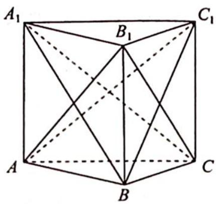

> [!faq]- 《高考数学培优40讲》例题解析
>
> > [!success]- **【答案】** C
>
> > [!note]- **【分析】**
> > 分析 ➤ 先考虑研究的对象有三类: 底面边、侧棱、侧面对角线, 其中除了三条侧棱之间全部相互平行以外, 其余两种对象内部之间都存在异面直线的情况, 所以一共有 5 大类. 根据题意分棱柱侧棱与底面边、棱柱侧棱与侧面对角线、底面边与侧面对角线、底面边与底面边、侧面对角线与侧面对角线五类依次计数即可得答案.
>
> > [!note]- **【解析】**
> > 解析 如图所示,分以下几类:
> > 棱柱侧棱与底面边之间所构成的异面直线有 $3 \times 2 = 6$ 对.
> > 棱柱侧棱与侧面对角线之间所构成的异面直线有 $3 \times 2 = 6$ 对.
> > 底面边与侧面对角线之间所构成的异面直线有 $6 \times 2 = 12$ 对.
> > 底面边与底面边之间所构成的异面直线有 $3 \times 2 = 6$ 对.
> > 侧面对角线与侧面对角线之间所构成的异面直线有 $\frac{6\times2}{2}=6$ 对.
> > 所以共有 $6+6+12+6+6=36$ 对. 故选 C.
> > 
> > ## 评注
> > 由于是考虑两个元素(直线)之间的位置关系,本题也可以采用列表的方式进行分类,更加直观.
> > <table><tr><td></td><td>侧棱</td><td>底面边</td><td>侧面对角线</td></tr><tr><td>侧棱</td><td>无</td><td>3×2=6</td><td>3×2=6</td></tr><tr><td>底面边</td><td></td><td>3×2=6</td><td>6×2=12</td></tr><tr><td>侧面对角线</td><td></td><td></td><td>3×2=6</td></tr></table>
> > 本题不适合从对立面考虑. 假设从对立面考虑, 就要考虑共面的情况, 在计数过程中会发现存在多种重复的情况, 容易造成重复计数.
