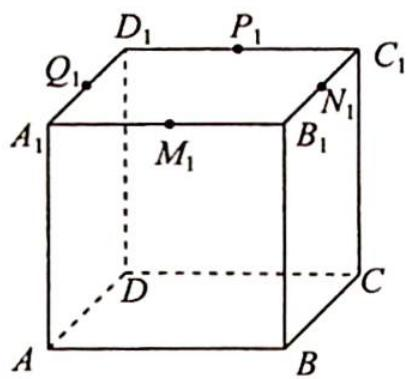
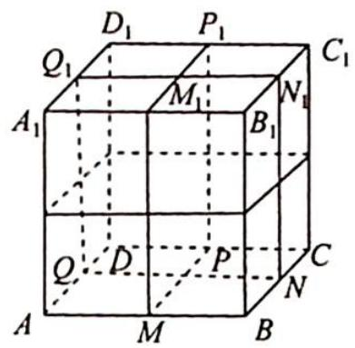
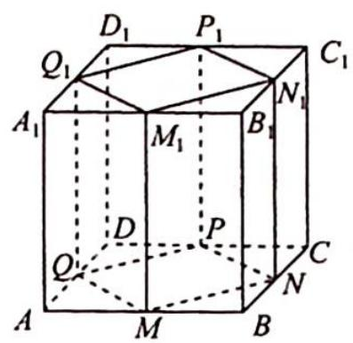
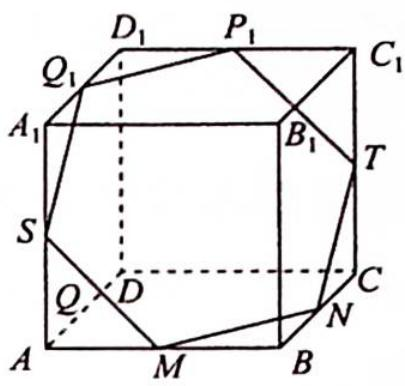

> [!faq]- 《高考数学培优40讲》例题解析
>
> > [!success]- **【答案】** A
>
> > [!note]- **【分析】**
> > 分析 可以把各棱中点按照上、中、下三层标出来,会发现直接寻找仅过 $M$ 中三个点的平面情况比较复杂,规律性不强,不妨尝试从对立面考虑解决问题,即先考虑过四个点及以上的情况有多少种.
> >
> > 用一个平面截正方体,最多可以过6个棱的中点(如果多于6个中点,则至少过同一层的3个中点,此时截面与某个侧面共面,与题意不符).其次由于所有点都是棱的中点,也不可能只经过5个点.所以问题的对立面只有经过4个点和6个点两类.
>
> > [!note]- **【解析】**
> > 解析 ▶ 通过 M 中三个点的平面一共有 $C_{12}^{3}=220$ 个(包含重复的).
> > 其中, 过 M 中四个点的平面有 3 种情况:
> > - **①**：正方体的6个面过各自包含的棱的4个中点,如图1中四边形 $A_{1}B_{1}C_{1}D_{1}$ 所示,一共有6个不同平面.
> > - **②**：过正方体中心的中截面,如图2中四边形 $QNN_{1}Q_{1}$ 所示,一共有3个不同平面.
> > - **③**：平行于侧棱且不过正方体中心的截面,如图3中四边形 $QMM_{1}Q_{1}$ 所示,共有12个不同的平面.
> > - **④**：过 M 中六个点, 如图 4 中的平面 $MNTP_{1}Q_{1}S$ 所示, 有 4 个不同平面.
> > 
> > 图1
> > 
> > 图 2
> > 
> > 图3
> > 
> > 图4
> > 所以过且仅过 M 中四个点的平面共 $C_{4}^{3} \cdot (3 + 6 + 12) = 84$ 个；过六个点的平面共 $C_{6}^{3} \cdot 4 = 80$ 个.
> > 故过且仅过 $M$ 中三个点的平面共有 $220 - 84 - 80 = 56$ 个.
> >
> > 故选 **A**.
