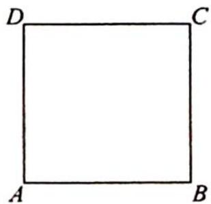

> [!faq]- 《高考数学培优40讲》例题解析
>
> > [!success]- **【答案】** 详见解析
>
> > [!note]- **【分析】**
> > 分析 ▶ 本题较为简单,可以分成使用 2 种颜色和 3 种颜色两大类对正方形顶点染色.
> >
> > 
>
> > [!note]- **【解析】**
> > 解析 ▶ 如果用 2 种颜色染色, 可以先从 3 种颜色中任选 2 种颜色, 有 $C_{3}^{2}$ 种, 此时处于对角线的两个顶点颜色必然相同, 对于固定的两种颜色有 2 种染色方式, 共有 $C_{3}^{2} \cdot 2 = 6$ 种.
> > 如果用 3 种颜色染色, 可以先选出两种颜色对 $A, B$ 染色, 共有 $\mathrm{C}_{3}^{2} \mathrm{~A}_{2}^{2} = \mathrm{A}_{3}^{2} = 6$ 种, 再从 $C, D$ 中选出一点用第三种颜色染色, 则最后一点只有一种颜色可选, 故有 $\mathrm{C}_{3}^{2} \mathrm{~A}_{2}^{2} \mathrm{C}_{2}^{1} \mathrm{C}_{1}^{1} = 6 \times 2 \times 1 = 12$ 种.
> > 所以一共有 $6+12=18$ 种染色方法.
> > 
> > # 慎入遗漏与重复的“坑”
> > 本题解答较为简单,但是仍有不少“坑”需要避免.在计数问题中,最常犯的错误就是“遗漏”和“重复”.针对上面题目中使用3种颜色给正方形染色,给出几种不同的方式,辨析其中的错误:
> > 方式一:先对 A, B, C 三个顶点用 3 种颜色染色, 则 D 点只有一种染色方式, 共有 $A_{3}^{3}A_{1}^{1}=6$ 种.
> > 方式二: 先从 3 种颜色中选 2 种颜色染 A, B 两点, 再从 C, D 两点中任选一点染第三种颜色, 最后一点只有一种颜色可选, 共有 $C_{3}^{2}A_{2}^{2}C_{2}^{1}C_{1}^{1}=6\times2\times1=12$ 种, 这就是题目解答中的方法.
> > 方式三: 在 4 个顶点中任选 3 个顶点, 用三种颜色染色, 最后一个点只有一种颜色可选, 共有 $A_{4}^{3} A_{1}^{1} = 24$ 种.
> > 方式一和方式三问题出在哪里？
> > 在方式一中，A, C 两点处于对角线位置，颜色可以相同，也可以不同。如果先对 A, B, C 三个顶点用 3 种颜色染色，则恰好遗漏了 A, C 颜色相同的情况，所以答案是正确答案的 $\frac{1}{2}$ 。
> > 在方式三中,因为是从4个点中任选3个顶点,用三种颜色染色,恰好是方式一的种数重复了4倍,所以答案是正确答案的2倍.
> > 所以在对几何体的顶点染色的问题中,如果对于固定的颜色数,比较稳妥的一种方法是先对顶点进行分层,逐层考虑每个顶点可选染色的种数,利用分步乘法计数求总的种类数.
