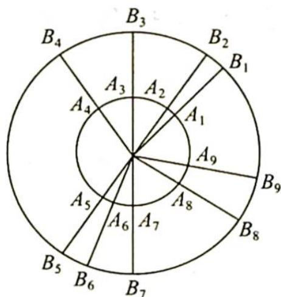
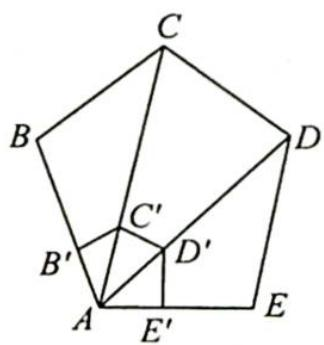
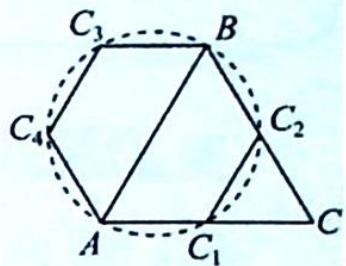

> [!faq]- 《高考数学培优40讲》例题解析
>
> > [!success]- **【答案】** 详见解析
>
> > [!note]- **【分析】**
> > 分析 ▶ 若考虑一个三角形,则只需要任意找出 5 个点以红蓝两色涂色,至少存在 3 个
> >
> > 点的颜色一致. 若考虑 2 个三角形, 只需要对 9 个点用两种颜色涂色, 则至少有 5 个点的颜色一致.
>
> > [!note]- **【解析】**
> > 解析 如图所示,作两个半径分别为 1 和 2023 的同心圆.在内圆上任取 9 个点,必有 5 点同色,记为 $A_{1}, A_{2}, A_{3}, A_{4}, A_{5}$ .延长半径 $OA_{i}$ 交大圆于 $B_{i} (i=1,2,3,4,5,6,7,8,9)$ ,则 $B_{1}, B_{2}, B_{3}, B_{4}, B_{5}$ 必有 3 点同色,记为 $B_{i}, B_{j}, B_{k}$ ,则 $\triangle B_{i} B_{j} B_{k}$ 与 $\triangle A_{i} A_{j} A_{k}$ 为三顶点同色的相似三角形,相似比等于 2023,满足题设条件.
> > 
> > ## 评注
> > 这里连续用了两次抽屉原理(以染色作“抽屉”), 也可以一开始就取位似比为2023的9个位似点组 $(A_{i}, B_{i})$ (i=1,2,3,4,5,6,7,8,9), 对4个“抽屉”(红, 红), (红,蓝), (蓝,红), (蓝,蓝)应用抽屉原理, 得出必有3个位似点属于“同一抽屉”.
> > 当然,不用同心圆也可证得,如在平面上取任三点都不共线的9点,由抽屉原理可得必有5点同色,设为A,B,C,D,E;以A为位似中心(如图所示),以2023为位似比作ABCDE的位似形 $A^{\prime}B^{\prime}C^{\prime}D^{\prime}E^{\prime}$ ,则5点 $A,B^{\prime},C^{\prime},D^{\prime},E^{\prime}$ 中必有3点同色,设为 $B^{\prime},D^{\prime},E^{\prime}$ ,即为所求.
> > 
> > 研究反思
> > # 对同色相似三角形的探究与推广
> > 对于上述例题的结论,还可以进行以下探究.
> > (1) 更一般地可以证明, 在这个二染色的平面上存在无数个内角为 $30^{\circ}, 60^{\circ}, 90^{\circ}$ 的直角三角形三顶点同色: 任取 $a \in \mathbf{R}_{+}$ , 以 $a$ 为边作等边三角形, 则必有两点同色, 记为 $A, B$ 同红色,
> > 以 AB 为直径作一圆, 再作圆内接正六边形 $AC_{1}C_{2}BC_{3}C_{4}$ (如图所示), 当 $C_{i}$ (i=1,2,3,4) 中有红点时, $\triangle AC_{i}B$ 即为所求; 当 $C_{i}$ (i=1,2,3,4) 中无红点, 即 $C_{i}$ (i=1,2,3,4) 全为蓝色时, $Rt\triangle C_{1}C_{2}C_{3}$ 即为所求. 再由 a 的任意性知这样的三角形有无数个.
> > 
> > (2) 更进一步还可以得到: 对任何 $a \in \mathbf{R}_{+}$ , 可得到两个相似比为 $a$ 的顶点同色的相似三角形. 对于多染色的情形, 还可以得出多个相似三角形的结论: 用红、黄、蓝三种颜色对平面上的点染色, 对任意的 $a, b \in \mathbf{R}_{+}$ , 必存在三个三角形, 它们彼此相似, 相似比为 $1: a:b$ , 且每个三角形的三顶点同色.
