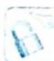

## 38.3 相异元素的可重组合

## 研究密钥

## 1. 相异元素不重组合

从 n 个给定的不同元素中, 每次取出 m 个不同元素, 直接并作一组, 称为 n 个异元的 m 不重元组合, 记作 $C_{n}^{m}$ . 由乘法原理得 $C_{n}^{m}m! = A_{n}^{m} \Leftrightarrow C_{n}^{m} = \frac{A_{n}^{m}}{m!} = \frac{n!}{m!(n-m)!}$ , 其中规定 0! = 1.

## 2. 相异元素可重复组合

从 $\{1,2,\cdots,n\}$ 中任取k个元素的可以重复的组合数是 $C_{n+k-1}^{k}$ .

【证明】把取出的 $k$ 个数排序为 $1 \leqslant x_{1} \leqslant x_{2} \leqslant \cdots \leqslant x_{k} \leqslant n$ , 化为不同元问题: $1 \leqslant x_{1} < x_{2} + 1 < x_{3} + 2 < \cdots < x_{k} + k - 1 \leqslant n + k - 1$ , 由组合数公式可得 $C_{n+k-1}^{k}$ .

## 3. 不定方程的解的个数

不定方程 $x_{1}+x_{2}+\cdots+x_{k}=n(k,n\in\mathbb{N}^{*})$ ，当 $n\geqslant k$ 时，其正整数解 $(x_{1},x_{2},\cdots,x_{k})$ （有序正整数 k 元组）个数是 $C_{n-1}^{k-1}$ ；非负整数解 $(x_{1},x_{2},\cdots,x_{k})$ （有序非负整数 k 元组）个数是 $C_{n+k-1}^{k-1}$ 。

【证明】（证法一：隔板法）把 $n$ 个元素分成 $k$ 组，第 $i$ 组的元素个数为 $x_{i}$

若每一组都非空, 只需在元素之间的 $n-1$ 个空隙中选出 $k-1$ 个放置隔板, 即方程 $x_1 + x_2 + \cdots + x_k = n (k, n \in \mathbb{N}^*)$ 的正整数解为 $\mathrm{C}_{n-1}^{k-1}$ .

若允许有某些组为空,转化为 $(x_{1}+1)+(x_{2}+1)+\cdots+(x_{k}+1)=n+k$ ,所以方程的非负整数解个数等于方程 $y_{1}+y_{2}+\cdots+y_{k}=n+k$ 的正整数解个数 $C_{n+k-1}^{k-1}$ .

(证法二:构造相异元素可重复组合)令 $y_{1}=x_{1}, y_{2}=x_{1}+x_{2}, \cdots, y_{k-1}=x_{1}+x_{2}+\cdots+x_{k-1}$ ，则把正整数解 $(x_{1}, x_{2}, \cdots, x_{k})$ 对应于一个唯一的递增正整数 k-1 项数列 $1 \leqslant y_{1} < y_{2} < \cdots < y_{k-1} \leqslant n-1$ 。由组合数公式可得方程的正整数解是 $C_{n-1}^{k-1}$ 。

把非负整数解转化为正整数解,则 $(x_{1} + 1) + (x_{2} + 1) + \dots + (x_{k} + 1) = n + k$ , 所以方程的非负整数解个数等于方程 $z_{1} + z_{2} + \dots + z_{k} = n + k$ 的正整数解个数 $C_{n+k-1}^{k-1}$ .

![[高中/总复习/专题/高考数学培优40讲/高考数学培优40讲-04-立体几何与概率统计/第38讲_排列组合中的转化与化归思想/38_3_相异元素的可重组合/例题/Q00020155.md]]
![[高中/总复习/专题/高考数学培优40讲/高考数学培优40讲-04-立体几何与概率统计/第38讲_排列组合中的转化与化归思想/38_3_相异元素的可重组合/例题/Q00020156.md]]
![[高中/总复习/专题/高考数学培优40讲/高考数学培优40讲-04-立体几何与概率统计/第38讲_排列组合中的转化与化归思想/38_3_相异元素的可重组合/例题/Q00020157.md]]
![[高中/总复习/专题/高考数学培优40讲/高考数学培优40讲-04-立体几何与概率统计/第38讲_排列组合中的转化与化归思想/38_3_相异元素的可重组合/例题/Q00020158.md]]
![[高中/总复习/专题/高考数学培优40讲/高考数学培优40讲-04-立体几何与概率统计/第38讲_排列组合中的转化与化归思想/38_3_相异元素的可重组合/例题/Q00020159.md]]
![[高中/总复习/专题/高考数学培优40讲/高考数学培优40讲-04-立体几何与概率统计/第38讲_排列组合中的转化与化归思想/38_3_相异元素的可重组合/例题/Q00020160.md]]
![[高中/总复习/专题/高考数学培优40讲/高考数学培优40讲-04-立体几何与概率统计/第38讲_排列组合中的转化与化归思想/38_3_相异元素的可重组合/例题/Q00020161.md]]
![[高中/总复习/专题/高考数学培优40讲/高考数学培优40讲-04-立体几何与概率统计/第38讲_排列组合中的转化与化归思想/38_3_相异元素的可重组合/例题/Q00020162.md]]
![[高中/总复习/专题/高考数学培优40讲/高考数学培优40讲-04-立体几何与概率统计/第38讲_排列组合中的转化与化归思想/38_3_相异元素的可重组合/例题/Q00020163.md]]
![[高中/总复习/专题/高考数学培优40讲/高考数学培优40讲-04-立体几何与概率统计/第38讲_排列组合中的转化与化归思想/38_3_相异元素的可重组合/例题/Q00020164.md]]
![[高中/总复习/专题/高考数学培优40讲/高考数学培优40讲-04-立体几何与概率统计/第38讲_排列组合中的转化与化归思想/38_3_相异元素的可重组合/例题/Q00020165.md]]
![[高中/总复习/专题/高考数学培优40讲/高考数学培优40讲-04-立体几何与概率统计/第38讲_排列组合中的转化与化归思想/38_3_相异元素的可重组合/例题/Q00020166.md]]
