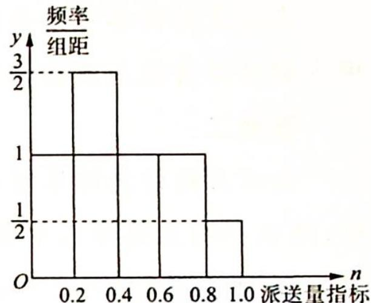

> [!faq]- 《高考数学培优40讲》例题解析
>
> > [!success]- **【答案】** 详见解析
>
> > [!note]- **【分析】**
> > 本题未单列分析。
>
> > [!note]- **【解析】**
> > 
> > - **①**：根据以上数据,设每名派送员的日薪为 X(单位:元),试分别求出甲、乙两种方案的日薪 X 的分布列,数学期望及方差;
> > - **②**：结合①中的数据,根据统计学的思想,帮助小明分析他选择哪种薪酬方案比较合适,并说明你的理由.
> > 参考数据: $0.6^{2}=0.36, 1.4^{2}=1.96, 2.6^{2}=6.76, 3.4^{2}=11.56, 3.6^{2}=12.96, 4.6^{2}=21.16,$ $15.6^{2}=243.36, 20.4^{2}=416.16, 44.4^{2}=1971.36.$
> > 解析 (1) 甲方案中派送员日薪 $y$ (单位: 元) 与派送单数 $n$ 的函数关系式为 $y = 100 + n (n \in \mathbf{N})$ ; 乙方案中派送员日薪 $y$ (单位: 元) 与送单数 $n$ 的函数关系式为 $y = \left\{ \begin{array}{l} 140, (n \leqslant 55, n \in \mathbf{N}) \\ 12n - 520, (n > 55, n \in \mathbf{N}) \end{array} \right.$ .
> > (2)①由题意知在这 100 天中,该公司派送员每日平均派送单数满足如下表格：
> > <table><tr><td>单数</td><td>52</td><td>54</td><td>56</td><td>58</td><td>60</td></tr><tr><td>频率</td><td>0.2</td><td>0.3</td><td>0.2</td><td>0.2</td><td>0.1</td></tr></table>
> > $X_{\text{甲}}$ 的分布列为
> > <table><tr><td> $X_{甲}$ </td><td>152</td><td>154</td><td>156</td><td>158</td><td>160</td></tr><tr><td>P</td><td>0.2</td><td>0.3</td><td>0.2</td><td>0.2</td><td>0.1</td></tr></table>
> > 所以 $E(X_{\text{甲}}) = 152 \times 0.2 + 154 \times 0.3 + 156 \times 0.2 + 158 \times 0.2 + 160 \times 0.1 = 155.4, D(X_{\text{甲}}) = 0.2 \times (152 - 155.4)^2 + 0.3 \times (154 - 155.4)^2 + 0.2 \times (156 - 155.4)^2 + 0.2 \times (158 - 155.4)^2 + 0.1 \times (160 - 155.4)^2 = 6.44.$
> > $X_{\text{乙}}$ 的分布列为
> > <table><tr><td> $X_{乙}$ </td><td>140</td><td>152</td><td>176</td><td>200</td></tr><tr><td>P</td><td>0.5</td><td>0.2</td><td>0.2</td><td>0.1</td></tr></table>
> > 所以 $E(X_{\text{乙}}) = 140 \times 0.5 + 152 \times 0.2 + 176 \times 0.2 + 200 \times 0.1 = 155.6, D(X_{\text{乙}}) = 0.5 \times (140 - 155.6)^2 + 0.2 \times (152 - 155.6)^2 + 0.2 \times (176 - 155.6)^2 + 0.1 \times (200 - 155.6)^2 = 404.64.$
> > ## ②答案一：
> > 由以上的计算可知虽然 $E(X_{\text{甲}}) < E(X_{\text{乙}})$ , 但两者相差不大, 且 $D(X_{\text{甲}})$ 远小于 $D(X_{\text{乙}})$ , 即甲方案日工资收入波动相对较小, 所以小明应选择甲方案.
> > ## 答案二：
> > 由以上的计算结果可以看出 $E(X_{甲}) < E(X_{乙})$ ，即甲方案日工资期望小于乙方案日工资期望，所以小明应选择乙方案。
