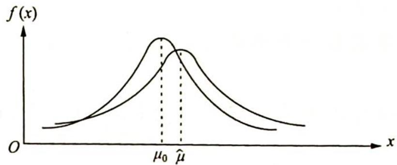

> [!faq]- 《高考数学培优40讲》例题解析
>
> > [!success]- **【答案】** 详见解析
>
> > [!note]- **【分析】**
> > 分析 ▶ 本题给出了新统计量服从标准正态分布,因此考虑利用 $3\sigma$ 原则制定评价标准.
>
> > [!note]- **【解析】**
> > 解析 ▶ (1)由题意可知,机器工作正常的情况下每袋葡萄糖的重量 m 服从正态分布 $N(0.5,0.015^{2})$ , 设 X 为 n 次独立重复包装葡萄糖重量正常的袋数.
> > 由 $P(\mu - \sigma < Z < \mu + \sigma) = 0.6826$ 知 $X$ 服从二项分布 $X \sim B(n, 0.6826)$ .
> > 于是 $P(x \geqslant 1) = 1 - P(x = 0) = 1 - (1 - 0.6826)^n \geqslant 0.98$ ，即 $0.3174^n \leqslant 0.02, n \geqslant \frac{\ln(0.02)}{\ln(0.3174)}$ ，解得 $n > 3.55$ .
> > 故需至少包装 4 袋葡萄糖, 才能使“至少有一袋包装的葡萄糖重量正常”的概率大于 0.98.
> > 而 $E(X)=np=0.6826n$ ，故相应成本 $Y=n+(n-X)=-X+2n, E(Y)=-E(X)+2n=$
> > $2n - 0.6826n = 1.3174n \geqslant 5.2696 (n \geqslant 4)$ , 所以相应成本的最小期望值为 5.2696 元.
> > (2)①如图所示,经计算得 $\hat{\mu}=\bar{x}=0.500+\frac{-0.004+0.008+0.024+0.019-0.005+0.010+0.022+0.013+0.012}{9}=0.511,\hat{\mu}>\mu_{0}=0.5$ . (绘图时只需保证 $\hat{\mu}$ 在 $\mu_{0}$ 的右侧,且峰值略低于原图像峰值)
> > 
> > - **②**：由题得 $n = 9, \mu_0 = 0.5, \sigma = 0.015, \hat{\mu} = \overline{x} = 0.511, |Z| = \left|\frac{\hat{\mu} - \mu_0}{\frac{\sigma}{\sqrt{n}}}\right| = \left|\frac{0.511 - 0.5}{\frac{0.015}{\sqrt{9}}}\right| = 2.2 > 2.$
> > 又 $Z \sim N(0,1), \mu_1 = 0, \sigma_1 = 1$ ，所以 $P(\mu_1 - 2\sigma_1 < Z < \mu_1 + 2\sigma_1) = P(-2 < Z < 2) = 0.9544$ ，故取 $a = 0.0456$ .
> > 所以在犯错误概率不超过 0.0456 的前提下, 认为该包装机工作异常, 应该进行调试.
