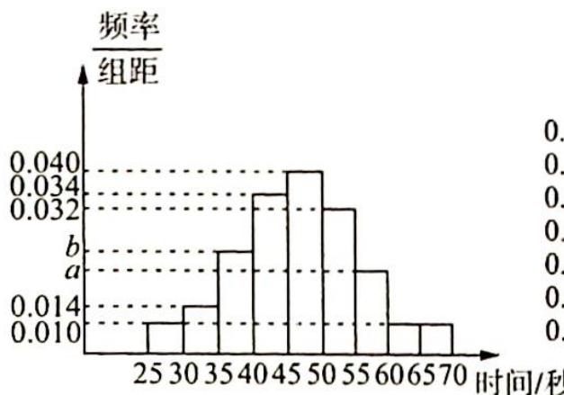
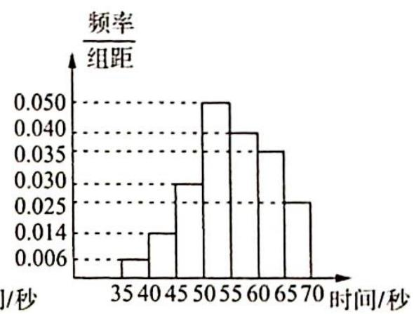

<!-- question-source:start -->
4. 由甲、乙、丙三个人组成的团队参加某项闯关游戏, 第一关解密码锁, 3 个人依次进行, 每人必须在 1 分钟内完成, 否则派下一个人. 3 个人中只要有一人能解开密码锁, 则该团队进入下一关, 否则淘汰出局. 根据以往 100 次的测试, 分别获得甲、乙解开密码锁所需时间的频率分布直方图, 如图 1、图 2 所示.

图 1

图 2

(1)若甲解开密码锁所需时间的中位数为 47, 求 $a, b$ 的值, 并分别求出甲、乙在 1 分钟内解开密码锁的频率;

(2)若以解开密码锁所需时间位于各区间的频率代替解开密码锁所需时间位于该区间的概率,并且丙在1分钟内解开密码锁的概率为0.5,各人是否解开密码锁相互独立.

①按乙、丙、甲的先后顺序和按丙、乙、甲的先后顺序哪一种可使派出人员数目的数学期望更小；

②试猜想:该团队以怎样的先后顺序派出人员,可使所需派出的人员数目 X 的数学期望达到最小,不需要说明理由.
<!-- question-source:end -->

![[Q00020194A1]]
