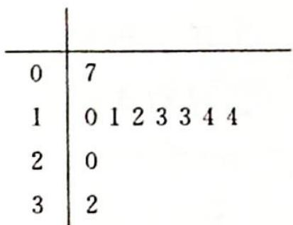

> [!faq]- 《高考数学培优40讲》例题解析
>
> > [!success]- **【答案】** 详见解析
>
> > [!note]- **【分析】**
> > 本题未单列分析。
>
> > [!note]- **【解析】**
> > 
> > (2)用抽到的 10 户家庭作为样本估计全市的居民用水情况,从全市依次随机抽取 10 户,若抽到 $n$ 户月用水量为二阶的可能性最大,求 $n$ 的值.
> > 解析 ▶ (1)由茎叶图可知抽取的 10 户中用水量为一阶的有 2 户,二阶的有 6 户,三阶的有 2 户.第二阶梯水量的户数 $X$ 的可能取值为 0,1,2,3.
> > 则 $P(X = 0) = \frac{\mathrm{C}_4^3\mathrm{C}_6^0}{\mathrm{C}_{10}^3} = \frac{1}{30}; P(X = 1) = \frac{\mathrm{C}_4^2\mathrm{C}_6^1}{\mathrm{C}_{10}^3} = \frac{3}{10}; P(X = 2) = \frac{\mathrm{C}_4^1\mathrm{C}_6^2}{\mathrm{C}_{10}^3} = \frac{1}{2}; P(X = 3) =$ $\frac{\mathrm{C}_4^0\mathrm{C}_6^3}{\mathrm{C}_{10}^3} = \frac{1}{6}.$
> > 所以 $X$ 的分布列为
> > <table><tr><td>X</td><td>0</td><td>1</td><td>2</td><td>3</td></tr><tr><td>P</td><td> $\frac{1}{30}$ </td><td> $\frac{3}{10}$ </td><td> $\frac{1}{2}$ </td><td> $\frac{1}{6}$ </td></tr></table>
> > 数学期望 $E(X)=0\times\frac{1}{30}+1\times\frac{3}{10}+2\times\frac{1}{2}+3\times\frac{1}{6}=\frac{9}{5}.$
> > (2) 设 Y 为从全市抽取的 10 户中用水量为二阶的家庭户数, 依题意得 $Y \sim B\left(10, \frac{3}{5}\right)$ , 所以 $P(Y=k)=C_{10}^{k}\left(\frac{3}{5}\right)^{k}\left(\frac{2}{5}\right)^{10-k}$ ，其中 $k=0,1,2,\cdots,10.$
> > $$
> > t = \frac {P (Y = k)}{P (Y = k - 1)} = \frac {\mathrm{C} _ {1 0} ^ {k} \left(\frac {3}{5}\right) ^ {k} \left(\frac {2}{5}\right) ^ {1 0 - k}}{\mathrm{C} _ {1 0} ^ {k - 1} \left(\frac {3}{5}\right) ^ {k - 1} \left(\frac {2}{5}\right) ^ {1 1 - k}} = \frac {3 (1 1 - k)}{2 k}.
> > $$
> > 若 $t > 1$ ，则 $k <   6.6,P(Y = k - 1) <   P(Y = k)$ ；若 $t <   1$ ，则 $k > 6.6,P(Y = k - 1) > P(Y = k).$
> > 所以当 $k = 6$ 或7时， $P(Y = k)$ 可得最大， $\frac{P(Y = 6)}{P(Y = 7)} = \frac{\mathrm{C}_{10}^{6}\left(\frac{3}{5}\right)^{6}\left(\frac{2}{5}\right)^{4}}{\mathrm{C}_{10}^{7}\left(\frac{3}{5}\right)^{7}\left(\frac{2}{5}\right)^{3}} = \frac{7}{6} > 1$ ，故 $n$ 的取值
> > 为6.
