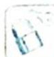

## 40.7 概率中的数列思想

研究密钥

离散型随机变量的另外一个重要特征就是“离散”, 因此具有数列的一般性质. 在某些随机变化的过程中, 如果随机变量在前一时刻的取值与后一时刻的取值相互之间不独立, 且往往可以建立两个时刻随机变量取值概率的递推关系, 然后根据初始值得到随机变量概率的一个通项公式, 这就是概率中的数列思想.

处理这类问题时,要具备一个“由果索因”的思考方式,即当前状态的前一种状态是什么,两种状态之间的“迁移概率”是多少,再利用全概率公式得到递推关系.

![[高中/总复习/专题/高考数学培优40讲/高考数学培优40讲-04-立体几何与概率统计/第40讲_概率统计核心概念与数学建模思想在高考中的应用/概率中的数学建模思想/40_7_概率中的数列思想/例题/Q00020224.md]]
![[高中/总复习/专题/高考数学培优40讲/高考数学培优40讲-04-立体几何与概率统计/第40讲_概率统计核心概念与数学建模思想在高考中的应用/概率中的数学建模思想/40_7_概率中的数列思想/例题/Q00020225.md]]
![[高中/总复习/专题/高考数学培优40讲/高考数学培优40讲-04-立体几何与概率统计/第40讲_概率统计核心概念与数学建模思想在高考中的应用/概率中的数学建模思想/40_7_概率中的数列思想/例题/Q00020226.md]]
![[高中/总复习/专题/高考数学培优40讲/高考数学培优40讲-04-立体几何与概率统计/第40讲_概率统计核心概念与数学建模思想在高考中的应用/概率中的数学建模思想/40_7_概率中的数列思想/例题/Q00020227.md]]
