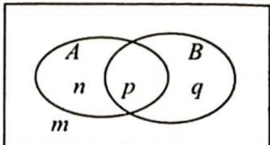

> [!faq]- 《高考数学培优40讲》例题解析
>
> > [!success]- **【答案】** AD
>
> > [!note]- **【分析】**
> > 本题未单列分析。
>
> > [!note]- **【解析】**
> > 解析 由题意得 $P(\overline{A} | B) = P(\overline{A} | \overline{B}) \Leftrightarrow \frac{P(\overline{A} B)}{P(B)} = \frac{P(\overline{A} \overline{B})}{P(\overline{B})} \Leftrightarrow \frac{P(\overline{A} B)}{P(B)} = \frac{P(\overline{A}) - P(\overline{A} B)}{1 - P(B)}$ $\Leftrightarrow P(\overline{A} B) - P(\overline{A} B)P(B) = P(\overline{A})P(B) - P(\overline{A} B)P(B)$ $\Leftrightarrow P(\overline{A} B) = P(\overline{A})P(B)$ $\Leftrightarrow P(B) - P(AB) = [1 - P(A)]P(B)$ $\Leftrightarrow P(AB) = P(A)P(B)$ .
> > 对于 B, C 可以利用韦恩图举反例, 如图所示, 由 $P(\overline{A} \mid B) = P(\overline{A} \mid \overline{B})$ 可知 q = m, 取 m = q = 2, n = p = 4, 则 $P(\overline{A} \mid B) = \frac{q}{p + q} = \frac{2}{2 + 4} = \frac{1}{3}$ , $P(\overline{A} \mid \overline{B}) = \frac{m}{m + n} = \frac{2}{2 + 4} = \frac{1}{3}$ , 故 BC 错误.
> > 
> > 综上所述,
> >
> > 故选 **AD**.
