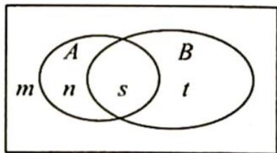

> [!faq]- 《高考数学培优40讲》例题解析
>
> > [!success]- **【答案】** AC
>
> > [!note]- **【分析】**
> > 本题未单列分析。
>
> > [!note]- **【解析】**
> > $$
> > P (\overline {{{A}}} \mid B) = \frac {P (\overline {{{A}}} B)}{P (B)} = \frac {t}{s + t}
> > $$
> > 
> > $$
> > P (B \mid \overline {{{A}}}) = \frac {P (\overline {{{A}}} B)}{P (\overline {{{A}}})} = \frac {t}{m + t}
> > $$
> > $$
> > P (\bar {A} \mid B) = P (B \mid \bar {A})
> > $$
> > $$
> > s = m. P (A) =
> > $$
> > $$
> > \frac {n + s}{m + n + s + t}, P (B) = \frac {t + s}{m + n + s + t}
> > $$
> > $$
> > P (A) + P (B) = \frac {n + s}{m + n + s + t} + \frac {t + s}{m + n + s + t} = \frac {n + s + t + m}{m + n + s + t} =
> > $$
> > 又 $P(\overline{B}|\overline{A}) = \frac{P(\overline{A}\overline{B})}{P(\overline{A})} = \frac{m}{m + t}, P(A|B) = \frac{P(AB)}{P(B)} = \frac{s}{s + t} = \frac{m}{m + t} = P(\overline{B}|\overline{A})$ ，所以C正确.
> > 取 $m = 1, n = 2, s = 1, t = 3$ ，则 $P(AB) = \frac{1}{7}, P(A) = \frac{3}{7}, P(B) = \frac{4}{7}, P(AB) \neq P(A)P(B)$ ；取 $m = n = s = t = 2$ ，则 $P(AB) = \frac{2}{8} = \frac{1}{4}, P(A) = \frac{4}{8} = \frac{1}{2}, P(B) = \frac{4}{8} = \frac{1}{2}$ ，故 $P(AB) = P(A)P(B)$ ，所以 $A, B$ 独立性无法判断，即 BD 都不正确，故选 AC.
> > 解法二: 因为 $P(\overline{A}|B)=\frac{P(\overline{A}B)}{P(B)}, P(B|\overline{A})=\frac{P(\overline{A}B)}{P(\overline{A})}$ ，又由 $P(\overline{A}|B)=P(B|\overline{A})$ 可知 $P(\overline{A})=P(B)$ ， $P(\overline{A})+P(A)=1$ ，所以 $P(A)+P(B)=1$ ，所以 A 正确.
> > 因为 $P(\overline{B}|\overline{A})=1-P(B|\overline{A})=1-P(\overline{A}|B)=P(A|B)$ ，所以 C 正确。
> > 又因为 $P(AB) = P(A)P(B|A)$ , 而 $A, B$ 的关系未知, 所以无法确定 $P(B)$ 与 $P(B|A)$ 的关系. 若 $A \cap B = \varnothing$ , 则 $P(AB) = 0 \neq P(A)P(B)$ ; 若取 $P(A) = \frac{1}{2}, P(B) = \frac{1}{2}, P(AB) = \frac{1}{4}$ , 此时
> > $P(AB)=P(A)P(B)$ ，则 BD 都不正确。
> > 综上所述,
> >
> > 故选 **AC**.
