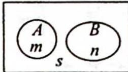

> [!faq]- 《高考数学培优40讲》例题解析
>
> > [!success]- **【答案】** D
>
> > [!note]- **【分析】**
> > 分析 ▶ 由条件概率的定义改写已知等式, 观察是否有 AB=∅ 或 P(AB)=P(A)P(B).
>
> > [!note]- **【解析】**
> > 解析 由已知等式知 $P(A \mid B) = 1 - P(\overline{A} \mid \overline{B}) = P(A \mid \overline{B})$ ，则 $\frac{P(AB)}{P(B)} = \frac{P(A\overline{B})}{P(\overline{B})} = \frac{P(A) - P(AB)}{1 - P(B)}$ .
> > 从而 $P(AB)[1 - P(B)] = [P(A) - P(AB)]P(B)$ , 化简得 $P(AB) = P(A)P(B)$ , 即 $A$ 与 $B$ 相互独立. 故选 D.
> > ## 评注
> > 判断两个事件是否互不相容或对立,也可以借助韦恩图辅助判断.如图所示,假设A和B互不相容,则利用韦恩图可以得到 $P(A|B)=\frac{P(AB)}{P(B)}=\frac{0}{n}=0$ , $P(\overline{A}|\overline{B})=\frac{P(\overline{A}\overline{B})}{P(\overline{B})}=\frac{s}{m+s}<1$ , 则 $P(AB)>0$ , A, B 不可能互斥或互不相容,即可排除A,B选项.但是独立性无法借助韦恩图直观判断.
> > 
