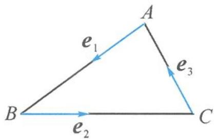

> [!faq]- 《浙大优辅《高中数学新体系 向量的秘密》》例题解析
>
> > [!success]- **【答案】** AB
>
> > [!note]- **【分析】**
> > 分析 本题看似是一道三角函数的问题,但其研究的对象是三角形的三个角,那么如何使用向量方法来刻画三角形三个内角的余弦值呢?
> >
> > 解答 如图 4.2-1, 设 $\overrightarrow{AB}, \overrightarrow{BC}, \overrightarrow{CA}$ 方向上的单位向量分别为 $e_{1}, e_{2}, e_{3}$ , 则有
> >
> > $$
> > \cos A + \cos B + \cos C = - e _ {1} \cdot e _ {3} - e _ {1} \cdot e _ {2} - e _ {3} \cdot e _ {2}.
> > $$
> >
> > 
> >
> > 因为
> >
> > 图4.2-1
> >
> > $(e_{1} + e_{2} + e_{3})^{2} = e_{1}^{2} + e_{2}^{2} + e_{3}^{2} + 2e_{1}\cdot e_{3} + 2e_{1}\cdot e_{2} + 2e_{3}\cdot e_{2} = 3 - 2(\cos A + \cos B + \cos C)\geqslant 0,$ 所以
> >
> > $$
> > \cos A + \cos B + \cos C \leqslant \frac {3}{2}.
> > $$
> >
> > 当且仅当 $e_{1}+e_{2}+e_{3}=0$ ，即 AB=BC=CA 时，取得等号.
> >
> > 点评 本题非常巧妙地利用了两个向量的同向单位向量的数量积来刻画向量夹角的余弦值, 即 $\cos \theta = \frac{a \cdot b}{|a||b|} = a_0 \cdot b_0$ , 这是一个全新的视角. 通过向量的代数运算解决几何问题, 也是向量法的精髓所在.
> >
> > ## 4.2.2 几何视角,图形探究
> >
> > 如果能利用向量的几何表示作出图形,那么用平面几何的知识也能帮助探求夹角.
>
> > [!note]- **【解析】**
> > 本题未单列解析。
