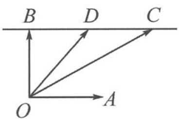
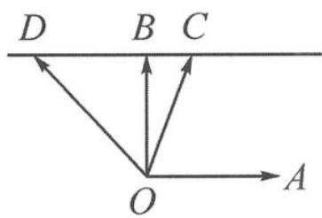

> [!faq]- 《浙大优辅《高中数学新体系 向量的秘密》》例题解析
>
> > [!success]- **【答案】** 详见解析
>
> > [!note]- **【分析】**
> > 本题未单列分析。
>
> > [!note]- **【解析】**
> > 解答 记 $a=\overrightarrow{OA}, b=\overrightarrow{OB}, b+xa=\overrightarrow{OC}, b+(x-1)a=\overrightarrow{OD}$ ，则点 C 和点 D 在过点 B 且与 OA 平行的直线上， $|CD|=1$ 。同时注意到 $|x|$ 的几何意义就是 $|BC|$ 的长度， $|x-1|$ 就是 $|BD|$ 的长度。
> > 要求的目标就是向量 $\overrightarrow{OC}$ 和 $\overrightarrow{OD}$ 的夹角正切值的最大值.
> > (1)如图4.2-4,当点 $C$ 和点 $D$ 在点 $B$ 的同侧时, 设 $BC = x \geqslant 1$ , $BD = x - 1$ , 则 $\tan \angle BOC = x$ , $\tan \angle BOD = x - 1$ . 所以
> > $$
> > \tan \angle D O C = \tan (\angle B O C - \angle B O D) = \frac {x - (x - 1)}{1 + x (x - 1)} = \frac {1}{x ^ {2} - x + 1} \leqslant 1,
> > $$
> > 当且仅当 x=1 时取得最大值.
> > 
> > 图4.2-4
> > 
> > 图4.2-5
> > (2)如图4.2-5,当点 $C$ 和点 $D$ 在点 $B$ 的异侧时, 设 $BC = x \in (0,1)$ , $BD = 1 - x$ , 则 $\tan \angle BOD = 1 - x$ , $\tan \angle BOC = x$ . 所以
> > $$
> > \tan \angle D O C = \tan (\angle B O D + \angle B O C) = \frac {x + 1 - x}{1 - x (1 - x)} = \frac {1}{x ^ {2} - x + 1} = \frac {1}{\left(x - \frac {1}{2}\right) ^ {2} + \frac {3}{4}} \leqslant \frac {4}{3},
> > $$
> > 当且仅当 $x=\frac{1}{2}$ 时取得最大值.
> > 综上, $f(x)$ 的最大值为 $\frac{4}{3}$ .
> > 点评 本题是上题的进化版,用向量刻画了平行线上的两个等距离动点,研究向量的夹角.实质还是仰角差模型的应用,但要注意分两种情况讨论.事实上,从相对运动的视角,可以将其想象成点 C 和点 D 是相距为 1 的两个定点,点 O 在定直线上运动,利用平面几何知识可以得到,当点 O 位于 CD 的中垂线上时, $\angle {DOC}$ 最大.
