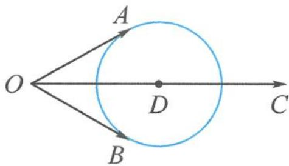

> [!faq]- 《浙大优辅《高中数学新体系 向量的秘密》》例题解析
>
> > [!success]- **【答案】** 详见解析
>
> > [!note]- **【分析】**
> > 分析 注意到题干条件 $a \cdot (c - a) = b \cdot (c - b) = 3$ 是同构式, 刻画的是同一个圆.
> >
> > 解答 由 $a \cdot (c - a) = 3$ 得 $a^2 - c \cdot a + \frac{c^2}{4} = 1$ , 即 $\left|a - \frac{c}{2}\right| = 1$ ;
> >
> > 由 $\boldsymbol{b} \cdot (\boldsymbol{c} - \boldsymbol{b}) = 3$ 得 $b^{2} - c \cdot b + \frac{c^{2}}{4} = 1$ ，即 $\left| b - \frac{c}{2} \right| = 1$ .
> >
> > 如图 4.2-6, 记 $a = \overrightarrow{OA}, b = \overrightarrow{OB}, c = \overrightarrow{OC}, \frac{c}{2} = \overrightarrow{OD}$ , 故点 $A, B$ 都在以 $D$ 为圆心, 1 为半径的圆上运动. 由平面几何知识知, 当 $OA, OB$ 均与圆相切时, $\angle AOB$ 最大. 此时
> >
> > 
> > 图4.2-6
> >
> > $$
> > \boldsymbol {a} \cdot \boldsymbol {b} = | \overrightarrow {O A} | | \overrightarrow {O B} | \cos \frac {\pi}{3} = \frac {3}{2}.
> > $$
> >
> > 点评 本题用向量刻画了一个几何知识点,即圆外一点与圆上两点连线的夹角最大为切线角,将问题转化求圆外一点与圆心连线距离最短.
>
> > [!note]- **【解析】**
> > 本题未单列解析。
